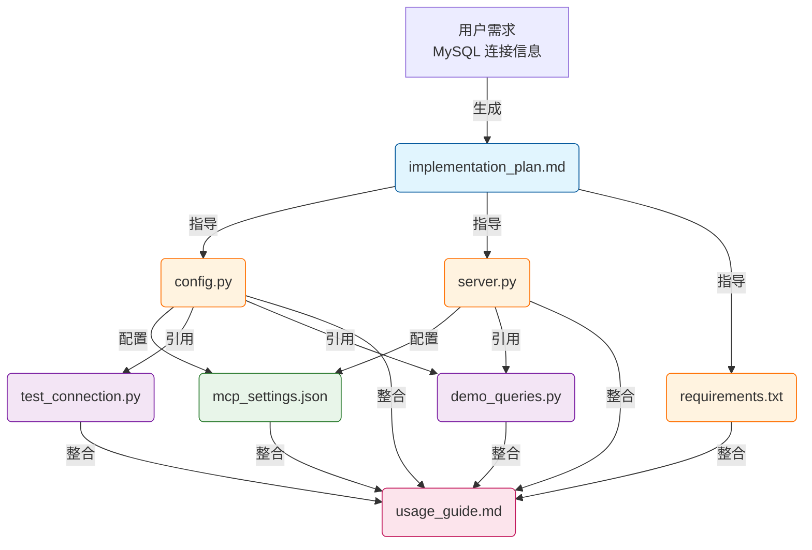

# ⛓️ 项目全链路执行手册：MCP MySQL Server 演示项目

---
**文档版本**: v1.1  
**创建日期**: 2026-01-20  
**项目目标**: 创建 MCP MySQL Server，演示 AI 通过 MCP 协议连接 MySQL 数据库的能力  
---

## 1. 产物目录结构 (File System)

*项目所有产出将严格按照以下结构归档：*

```text
output_LLM/mcp_mysql_demo/
├── 00_context/                    # 原始输入、背景资料
│   └── project_brief.md           # 项目立项书（本文档）
├── 01_planning/                   # 规划阶段产物
│   └── implementation_plan.md     # 实施计划书
├── 02_src/                        # 源代码
│   ├── server.py                  # MCP Server 主文件
│   ├── config.py                  # 配置文件
│   └── requirements.txt           # Python 依赖包
├── 03_config/                     # 配置文件
│   └── mcp_settings.json          # MCP Client 配置示例
├── 04_docs/                       # 文档
│   └── usage_guide.md             # 使用指南
└── 05_examples/                   # 调用示例
    ├── test_connection.py         # 连接测试脚本
    └── demo_queries.py            # 查询演示脚本
```

## 2. 产物依赖流 (Artifact Flow)

> *箭头表示数据的流向：前一个文件的内容是生成后一个文件的必要条件。*



## 3. 连接信息

| 参数 | 值 |
|------|------|
| **Host** | 172.17.1.141 |
| **Port** | 3307 |
| **Database** | test_ai |
| **User** | test_ai |
| **Password** | EB1FF34BA2C33780 |

## 4. 分步执行链 (Execution Chain)

### 🟢 阶段一：规划设计

*此阶段建立项目的"真理来源 (Source of Truth)"。*

- [x] **Step 1.1: 需求固化与计划制定**
    - 📥 **Input (依赖)**: 用户提供的 MySQL 连接信息
    - 📤 **Output (产出)**: `00_context/project_brief.md`（本文档）
    - 💡 **执行逻辑**: 将用户需求转化为结构化计划书。
    - > **🤖 AI指令**: 读取用户提供的 MySQL 连接信息，生成项目计划书。

---

### 🟡 阶段二：核心落地

*此阶段创建 MCP Server 的核心代码。*

- [ ] **Step 2.1: 创建配置模块**
    - 📥 **Input (依赖)**: 
        - `00_context/project_brief.md`（连接信息）
    - 📤 **Output (产出)**: `02_src/config.py`
    - 💡 **执行逻辑**: 创建数据库配置模块，使用环境变量管理敏感信息。
    - > **🤖 AI指令**: 读取 `project_brief.md` 中的连接信息，创建 `config.py` 配置文件。使用环境变量存储敏感信息，并提供默认值。

- [ ] **Step 2.2: 创建依赖文件**
    - 📥 **Input (依赖)**: 无（标准依赖）
    - 📤 **Output (产出)**: `02_src/requirements.txt`
    - 💡 **执行逻辑**: 列出项目所需的 Python 包。
    - > **🤖 AI指令**: 创建 `requirements.txt`，包含 mcp、mysql-connector-python、python-dotenv 等依赖。

- [ ] **Step 2.3: 创建 MCP Server 主文件**
    - 📥 **Input (依赖)**: 
        - `02_src/config.py`（配置模块）
        - `MCP_MySQL连接示例教程_v1.0.md`（参考代码）
    - 📤 **Output (产出)**: `02_src/server.py`
    - 💡 **执行逻辑**: 创建完整的 MCP Server，支持查询表列表、表结构、执行 SQL。
    - > **🤖 AI指令**: 读取 `config.py` 和参考教程，创建 `server.py`。实现 list_resources、read_resource、list_tools、call_tool 四个核心方法。

- [ ] **Step 2.4: 创建 MCP Client 配置**
    - 📥 **Input (依赖)**: 
        - `02_src/server.py`（Server 路径）
        - `00_context/project_brief.md`（连接信息）
    - 📤 **Output (产出)**: `03_config/mcp_settings.json`
    - 💡 **执行逻辑**: 创建 MCP Client 配置文件示例。
    - > **🤖 AI指令**: 创建 `mcp_settings.json`，配置 Server 启动命令和环境变量。

---

### 🔴 阶段三：文档与验证

*此阶段整合所有产物，创建使用文档。*

- [ ] **Step 3.1: 创建连接测试脚本**
    - 📥 **Input (依赖)**: 
        - `02_src/config.py`（配置模块）
    - 📤 **Output (产出)**: `05_examples/test_connection.py`
    - 💡 **执行逻辑**: 创建独立的连接测试脚本，验证数据库连接。
    - > **🤖 AI指令**: 读取 `config.py`，创建测试脚本，包含：连接测试、获取表列表、简单查询。

- [ ] **Step 3.2: 创建查询演示脚本**
    - 📥 **Input (依赖)**: 
        - `02_src/config.py`（配置模块）
        - `02_src/server.py`（参考 MCP 工具定义）
    - 📤 **Output (产出)**: `05_examples/demo_queries.py`
    - 💡 **执行逻辑**: 创建演示脚本，展示各种查询场景。
    - > **🤖 AI指令**: 创建演示脚本，包含：查询表结构、条件查询、聚合查询、分页查询等示例。

- [ ] **Step 3.3: 创建使用指南**
    - 📥 **Input (依赖)**: 
        - `02_src/` 目录下所有文件
        - `03_config/mcp_settings.json`
        - `05_examples/` 目录下所有文件
    - 📤 **Output (产出)**: `04_docs/usage_guide.md`
    - 💡 **执行逻辑**: 编写完整的安装、配置、使用说明。
    - > **🤖 AI指令**: 整合 src、config 和 examples 目录的内容，编写详细的使用指南，包括：环境准备、安装步骤、配置方法、调用示例、常见问题。

---

## 5. 验证计划

### 5.1 功能验证

| 验证项 | 验证方法 | 预期结果 |
|--------|----------|----------|
| 数据库连接 | 运行 `python server.py` | 无报错启动 |
| 表列表获取 | 调用 `list_resources` | 返回 test_ai 库的表列表 |
| SQL 查询 | 调用 `query` 工具 | 返回查询结果 |

### 5.2 手动测试步骤

1. **安装依赖**：
   ```bash
   cd output_LLM/mcp_mysql_demo/02_src
   pip install -r requirements.txt
   ```

2. **测试连接**：
   ```bash
   python -c "import mysql.connector; conn = mysql.connector.connect(host='172.17.1.141', port=3307, user='test_ai', password='EB1FF34BA2C33780', database='test_ai'); print('连接成功'); conn.close()"
   ```

3. **运行 Server**（可选，需要 MCP Client）：
   ```bash
   python server.py
   ```

---

## 6. 风险与注意事项

> [!CAUTION]
> **敏感信息**：密码已在文档中明文显示，生产环境请务必使用环境变量或密钥管理服务。

> [!IMPORTANT]
> **网络要求**：需确保当前机器能够访问 172.17.1.141:3307。

---

## 版本记录

| 版本 | 日期 | 修改人 | 修改内容 |
|------|------|--------|----------|
| v1.0 | 2026-01-20 | AI Assistant | 初始创建 |
| v1.1 | 2026-01-20 | AI Assistant | 增加调用示例目录和步骤 |
