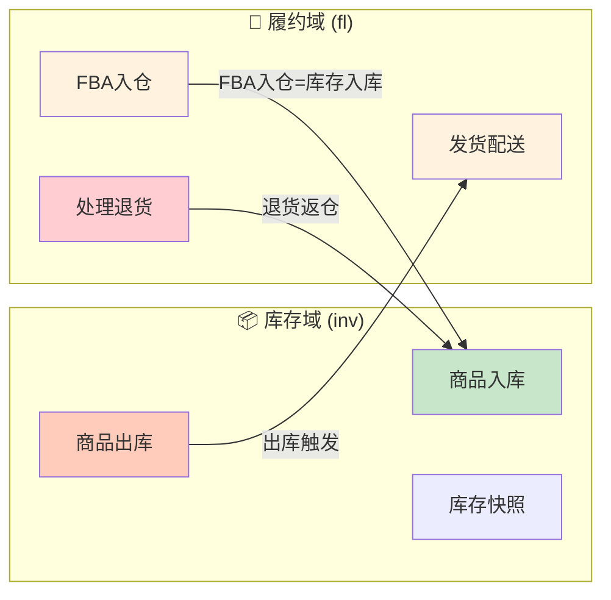

# 库存域与履约域对比分析报告	

> **版本**: v1.0	
> **创建日期**: 2026-01-19	
> **目的**: 对比分析库存域和履约域的业务流程与业务过程对应关系，评估总线矩阵设计合理性	

---

## 1. 分析概述	

本报告对比分析以下三个维度的一致性：	
1. **业务流程梳理文档** (`业务流程梳理/`) 中定义的业务过程	
2. **数据域详情文档** (`数据域详情/`) 中定义的业务过程	
3. **总线矩阵** (`01_总线矩阵_v1.0.md`) 中定义的业务过程与维度	

---

## 2. 库存域对比分析	

### 2.1 业务过程定义对比	

<table>
    <thead>
        <tr>
            <th>来源</th>
            <th>业务过程</th>
            <th>英文名称</th>
            <th>是否一致</th>
        </tr>
    </thead>
    <tbody>
        <tr>
            <td rowspan="5">业务流程梳理</td>
            <td>入库</td>
            <td>inbound</td>
            <td>✓ 对应</td>
        </tr>
        <tr>
            <td>库存</td>
            <td>inventory</td>
            <td>⚠️ 需澄清</td>
        </tr>
        <tr>
            <td>库龄</td>
            <td>inventory_age</td>
            <td>✓ 对应</td>
        </tr>
        <tr>
            <td>出库</td>
            <td>outbound</td>
            <td>✓ 对应</td>
        </tr>
        <tr>
            <td>损耗</td>
            <td>loss</td>
            <td>✓ 对应</td>
        </tr>
        <tr>
            <td rowspan="5">数据域详情</td>
            <td>商品入库</td>
            <td>stock_in</td>
            <td>✓</td>
        </tr>
        <tr>
            <td>商品出库</td>
            <td>stock_out</td>
            <td>✓</td>
        </tr>
        <tr>
            <td>库存盘点</td>
            <td>stock_check</td>
            <td>✓</td>
        </tr>
        <tr>
            <td>库龄分析</td>
            <td>inventory_aging</td>
            <td>✓</td>
        </tr>
        <tr>
            <td>库存损耗</td>
            <td>stock_loss</td>
            <td>✓</td>
        </tr>
        <tr>
            <td rowspan="4">总线矩阵</td>
            <td>商品入库</td>
            <td>fct_inv_stock_in</td>
            <td>✓</td>
        </tr>
        <tr>
            <td>商品出库</td>
            <td>fct_inv_stock_out</td>
            <td>✓</td>
        </tr>
        <tr>
            <td>库存盘点</td>
            <td>fct_inv_stock_daily</td>
            <td>✓</td>
        </tr>
        <tr>
            <td>库龄分析</td>
            <td>fct_inv_aging_daily</td>
            <td>✓</td>
        </tr>
    </tbody>
</table>

### 2.2 库存域差异分析	

| 问题编号 | 差异点 | 说明 | 建议 |	
|----------|--------|------|------|	
| INV-01 | 业务流程梳理的"库存"过程 | 流程梳理中将"库存"作为独立业务过程，但实际是状态快照非事件 | 与"库存盘点"合并，统一为周期快照事实表 |	
| INV-02 | 总线矩阵缺少"库存损耗"过程 | 数据域详情定义了库存损耗，但总线矩阵未纳入 | **建议补充** `fct_inv_stock_loss` 事实表到总线矩阵 |	
| INV-03 | 英文命名不一致 | 流程梳理用 `inbound/outbound`，详情用 `stock_in/stock_out` | 建议统一为 `stock_in/stock_out` |	

### 2.3 库存域总线矩阵评估	

**现有设计（数据域详情）：**	
| 业务过程 | 时间 | 产品 | 仓库 | 库存状态 | 库龄区间 | 仓库类型 |	
|----------|------|------|------|----------|----------|----------|	
| 商品入库 | ✓ | ✓ | ✓ | | | ✓ |	
| 商品出库 | ✓ | ✓ | ✓ | | | ✓ |	
| 库存盘点 | ✓ | ✓ | ✓ | ✓ | | ✓ |	
| 库龄分析 | ✓ | ✓ | ✓ | | ✓ | ✓ |	

**评估结论：✅ 合理**	
- 维度覆盖完整，时间/产品/仓库作为核心维度全覆盖	
- 库存状态仅用于盘点场景合理（可售/不可售）	
- 库龄区间仅用于库龄分析合理	

**建议补充：**	
| 业务过程 | 建议新增维度 | 理由 |	
|----------|--------------|------|	
| 商品入库 | 供应商维度 | 入库来源需要区分供应商 |	
| 库存损耗 | 损耗原因维度 | 区分超期/破损/丢失等原因 |	

---

## 3. 履约域对比分析	

### 3.1 业务过程定义对比	

<table>
    <thead>
        <tr>
            <th>来源</th>
            <th>业务过程</th>
            <th>英文名称</th>
            <th>是否一致</th>
        </tr>
    </thead>
    <tbody>
        <tr>
            <td rowspan="4">业务流程梳理</td>
            <td>发货配送</td>
            <td>ship_order</td>
            <td>✓ 对应</td>
        </tr>
        <tr>
            <td>FBA入仓</td>
            <td>fba_inbound</td>
            <td>✓ 对应</td>
        </tr>
        <tr>
            <td>处理退货</td>
            <td>process_return</td>
            <td>✓ 对应</td>
        </tr>
        <tr>
            <td>处理换货</td>
            <td>process_exchange</td>
            <td>⚠️ 缺失</td>
        </tr>
        <tr>
            <td rowspan="4">数据域详情</td>
            <td>发货配送</td>
            <td>ship_order</td>
            <td>✓</td>
        </tr>
        <tr>
            <td>FBA入仓</td>
            <td>fba_inbound</td>
            <td>✓</td>
        </tr>
        <tr>
            <td>处理退货</td>
            <td>process_return</td>
            <td>✓</td>
        </tr>
        <tr>
            <td>处理换货</td>
            <td>process_exchange</td>
            <td>✓</td>
        </tr>
        <tr>
            <td rowspan="4">总线矩阵</td>
            <td>发货配送</td>
            <td>fct_fl_shipment</td>
            <td>✓</td>
        </tr>
        <tr>
            <td>FBA入仓</td>
            <td>fct_fl_fba_inbound</td>
            <td>✓</td>
        </tr>
        <tr>
            <td>处理退货</td>
            <td>fct_fl_return</td>
            <td>✓</td>
        </tr>
        <tr>
            <td>物流履约</td>
            <td>fct_fl_delivery_snapshot</td>
            <td>✓（累积快照）</td>
        </tr>
    </tbody>
</table>

### 3.2 履约域差异分析	

| 问题编号 | 差异点 | 说明 | 建议 |	
|----------|--------|------|------|	
| FL-01 | 总线矩阵缺少"处理换货"过程 | 数据域详情定义了换货，但总线矩阵未单独列出 | 考虑是否并入退货事实表（增加退换标识维度） |	
| FL-02 | 物流履约累积快照 | 流程梳理提到"物流跟踪"，详情设计为累积快照，合理 | ✓ 设计合理，无需修改 |	
| FL-03 | 处理退货缺少仓库维度 | 总线矩阵中退货没有关联仓库维度 | **建议补充**仓库维度，退货返仓需要入库 |	

### 3.3 履约域总线矩阵评估	

**现有设计（数据域详情）：**	
| 业务过程 | 时间 | 产品 | 仓库 | 物流渠道 | 物流状态 | 退货原因 |	
|----------|------|------|------|----------|----------|----------|	
| 发货配送 | ✓ | ✓ | ✓ | ✓ | ✓ | |	
| FBA入仓 | ✓ | ✓ | ✓ | ✓ | ✓ | |	
| 处理退货 | ✓ | ✓ | | | | ✓ |	
| 物流履约 | ✓ | | ✓ | ✓ | ✓ | |	

**评估结论：⚠️ 基本合理，有改进空间**	
- 物流渠道/物流状态维度设计合理	
- 退货原因维度很好，支撑售后分析	
- 物流履约累积快照设计符合 Kimball 方法论	

**建议补充：**	
| 业务过程 | 建议 | 理由 |	
|----------|------|------|	
| 处理退货 | 增加仓库维度 | 退货返仓需要关联目标仓库 |	
| 处理换货 | 新增独立事实表或合并标识 | 换货和退货逻辑不同，需区分 |	

---

## 4. 库存域与履约域关联分析	

### 4.1 跨域业务关联	

### 4.2 维度共享分析	

| 共享维度 | 库存域使用 | 履约域使用 | 跨域价值 |	
|----------|-----------|-----------|----------|	
| 时间维度 | ✓ 全部过程 | ✓ 全部过程 | 时间序列分析 |	
| 产品维度 | ✓ 全部过程 | ✓ 大部分过程 | 商品级分析 |	
| 仓库维度 | ✓ 全部过程 | ✓ 发货/FBA | 仓库级库存与履约效率分析 |	

### 4.3 跨域分析场景	

| 分析场景 | 涉及事实表 | 价值 |	
|----------|-----------|------|	
| 库存周转 vs 履约时效 | 库存快照 + 物流履约 | 优化库存布局 |	
| 退货对库存影响 | 退货事实 + 入库事实 | 售后成本分析 |	
| FBA入仓效率 | FBA入仓 + 入库事实 | 补货计划优化 |	

---

## 5. 问题汇总与建议	

### 5.1 问题清单	

| 编号 | 域 | 问题类型 | 问题描述 | 优先级 |	
|------|-----|----------|----------|--------|	
| INV-01 | 库存 | 概念澄清 | "库存"应为状态而非独立业务过程 | P2 |	
| INV-02 | 库存 | 缺失 | 总线矩阵缺少库存损耗事实表 | **P1** |	
| INV-03 | 库存 | 命名 | 入出库英文命名不一致 | P3 |	
| FL-01 | 履约 | 缺失 | 总线矩阵缺少处理换货事实表 | **P1** |	
| FL-03 | 履约 | 设计 | 处理退货缺少仓库维度 | P2 |	

### 5.2 改进建议	

#### 建议一：补充总线矩阵（P1）	

**库存域补充：**	
| 业务过程 | 事实表 | 时间 | 产品 | 仓库 | 损耗原因 |	
|----------|--------|------|------|------|----------|	
| 库存损耗 | fct_inv_stock_loss | ✓ | ✓ | ✓ | ✓（新增）|	

**履约域补充：**	
| 业务过程 | 事实表 | 时间 | 产品 | 仓库 | 换货原因 |	
|----------|--------|------|------|------|----------|	
| 处理换货 | fct_fl_exchange | ✓ | ✓ | ✓（补充）| ✓（新增）|	

#### 建议二：统一命名规范（P3）	

| 业务过程 | 流程梳理命名 | 建议统一命名 |	
|----------|--------------|--------------|	
| 商品入库 | inbound | stock_in |	
| 商品出库 | outbound | stock_out |	

#### 建议三：补充维度定义	

| 新增维度 | 适用域 | 说明 |	
|----------|--------|------|	
| dim_loss_reason | 库存域 | 损耗原因维度（超期/破损/丢失）|	
| dim_exchange_reason | 履约域 | 换货原因维度 |	

---

## 6. 结论	

### 6.1 总体评估	

| 评估项 | 库存域 | 履约域 |	
|--------|--------|--------|	
| 业务过程定义完整性 | ⭐⭐⭐⭐☆ (4/5) | ⭐⭐⭐⭐☆ (4/5) |	
| 流程与详情一致性 | ⭐⭐⭐⭐☆ (4/5) | ⭐⭐⭐⭐☆ (4/5) |	
| 总线矩阵合理性 | ⭐⭐⭐☆☆ (3/5) | ⭐⭐⭐☆☆ (3/5) |	
| 维度设计合理性 | ⭐⭐⭐⭐☆ (4/5) | ⭐⭐⭐⭐☆ (4/5) |	
| 跨域协同设计 | ⭐⭐⭐⭐⭐ (5/5) | ⭐⭐⭐⭐⭐ (5/5) |	

### 6.2 核心结论	

1. **业务流程与业务过程基本对应**：两个域的流程梳理与详情定义大体一致	
2. **总线矩阵存在缺漏**：库存损耗、处理换货未纳入总线矩阵	
3. **跨域设计合理**：通过产品、仓库维度可实现跨域关联分析	
4. **建议后续补充**：完善损耗/换货事实表，统一命名规范	

---

## 更新记录	

| 版本 | 日期 | 更新内容 |	
|------|------|----------|	
| v1.0 | 2026-01-19 | 初始版本，完成库存域与履约域对比分析 |	
