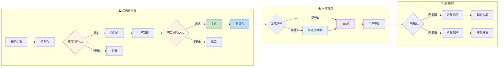

# 数据域流程修正计划书	

> **文档类型**: 计划书	
> **版本**: v1.0	
> **创建日期**: 2026-01-20	
> **状态**: 待执行	

---

## 1. 项目背景	

根据用户提供的完整供应链流程，需要对现有的数据域文档进行全面修正，确保业务流程、业务过程、维度、指标和总线矩阵与实际业务一致。	

---

## 2. 完整业务流程（权威定义）	

### 2.1 国内流程（正向）	

```
采购 → 待检仓 → 来料检验(IQC) → [通过] → 原料仓 → 生产 → 完工质检(OQC) → 主仓 → 物流仓
```

### 2.2 国际流程（正向）	

**路径A（经海外仓）**：	
```
物流仓 → 海外仓 → FBA仓 → 用户
```

**路径B（直送FBA）**：	
```
物流仓 → FBA仓 → 用户
```

### 2.3 逆向物流	

```
用户 → 退货申请 → 退货物流 → 海外仓/FBA仓 → 退货入库处理
用户 → 换货申请 → 换货发货 → 用户
```

### 2.4 完整端到端流程图	



---

## 3. 仓库分类（权威定义）	

```
仓库分类
├── 国内仓库（自有）
│   ├── 待检仓（采购物料暂存，待IQC检验）
│   ├── 原料仓（IQC通过的物料）
│   ├── 主仓（OQC通过的成品）
│   └── 物流仓（待发货成品，头程起点）
├── 海外仓库（自有，中转仓）
│   └── 只做中转，必须调拨到FBA仓
└── FBA仓库（亚马逊托管，销售终端）
    └── 亚马逊运营中心，唯一发货给用户的仓库
```

---

## 4. 受影响域与修改评估	

<table>
    <thead>
        <tr>
            <th>序号</th>
            <th>数据域</th>
            <th>影响程度</th>
            <th>当前版本</th>
            <th>目标版本</th>
            <th>主要修改内容</th>
        </tr>
    </thead>
    <tbody>
        <tr>
            <td>1</td>
            <td>库存域</td>
            <td>🔴 重大</td>
            <td>v2.1</td>
            <td>v2.2</td>
            <td>仓库分类细化（待检仓、原料仓、主仓、物流仓），入库出库业务过程更新</td>
        </tr>
        <tr>
            <td>2</td>
            <td>履约域</td>
            <td>🔴 重大</td>
            <td>v2.1</td>
            <td>v2.2</td>
            <td>明确物流仓为发货起点，完善逆向物流业务过程</td>
        </tr>
        <tr>
            <td>3</td>
            <td>品控域</td>
            <td>🟡 中等</td>
            <td>v2.0</td>
            <td>v2.1</td>
            <td>明确IQC在"待检仓→原料仓"环节，OQC在"生产→主仓"环节</td>
        </tr>
        <tr>
            <td>4</td>
            <td>供采域</td>
            <td>🟢 轻微</td>
            <td>v2.0</td>
            <td>v2.1</td>
            <td>明确采购收货地点是"待检仓"</td>
        </tr>
        <tr>
            <td>5</td>
            <td>生产域</td>
            <td>🟢 轻微</td>
            <td>v2.0</td>
            <td>v2.1</td>
            <td>明确原料来源是"原料仓"，成品去向是OQC然后"主仓"</td>
        </tr>
    </tbody>
</table>

---

## 5. 详细修改方案	

### 5.1 库存域修改	

#### 5.1.1 业务过程更新	

| 新编号 | 业务过程 | 英文名称 | 描述 | 事实表类型 |
|--------|----------|----------|------|-----------|
| 1 | 待检入库 | pending_stock_in | 采购到货进入待检仓 | 事务事实 |
| 2 | 原料入库 | material_stock_in | IQC通过后转入原料仓 | 事务事实 |
| 3 | 生产领料 | production_stock_out | 生产从原料仓领取物料 | 事务事实 |
| 4 | 成品入库 | finished_stock_in | OQC通过后转入主仓 | 事务事实 |
| 5 | 物流转仓 | logistics_transfer | 成品从主仓转至物流仓 | 事务事实 |
| 6 | 头程出库 | first_mile_out | 物流仓→海外仓/FBA仓 | 事务事实 |
| 7 | 头程入库 | first_mile_in | 海外仓/FBA仓接收入库 | 事务事实 |
| 8 | 销售出库 | sales_stock_out | 海外仓/FBA仓发货给用户 | 事务事实 |
| 9 | 退货入库 | return_stock_in | 用户退货入仓 | 事务事实 |
| 10 | 库存盘点 | stock_check | 定期盘点库存状态 | 周期快照 |
| 11 | 库龄分析 | inventory_aging | 分析库存周转和库龄分布 | 周期快照 |
| 12 | 库存损耗 | stock_loss | 记录库存损耗 | 事务事实 |

#### 5.1.2 维度更新	

| 维度名称 | 英文名称 | 维度值 |
|----------|----------|--------|
| 仓库类型维度 | dim_warehouse_type | 待检仓、原料仓、主仓、物流仓、海外仓、FBA仓 |
| 仓库区域维度 | dim_warehouse_region | 中国、美国、欧洲、日本等 |
| 入库类型维度 | dim_inbound_type | 采购入库(待检)、IQC通过入库、生产入库、头程入库、退货入库 |
| 出库类型维度 | dim_outbound_type | 生产领料、物流转仓、头程出库、销售出库、损耗出库 |

---

### 5.2 履约域修改	

#### 5.2.1 业务过程更新	

| 新编号 | 业务过程 | 英文名称 | 描述 | 事实表类型 |
|--------|----------|----------|------|-----------|
| 1 | 头程运输 | first_mile | 物流仓→海外仓/FBA仓的运输跟踪 | 累积快照 |
| 2 | 仓间调拨 | warehouse_transfer | 海外仓→FBA仓的调拨跟踪 | 事务事实 |
| 3 | 发货配送 | ship_order | 订单发货（海外仓/FBA发货） | 事务事实 |
| 4 | 物流履约 | delivery | 全程物流跟踪（发货→签收） | 累积快照 |
| 5 | 退货申请 | request_return | 用户发起退货申请 | 事务事实 |
| 6 | 退货物流 | return_shipping | 退货商品运输跟踪 | 累积快照 |
| 7 | 退货处理 | process_return | 退货入仓处理和退款 | 事务事实 |
| 8 | 换货申请 | request_exchange | 用户发起换货申请 | 事务事实 |
| 9 | 换货发货 | exchange_shipping | 换货商品重新发货 | 事务事实 |

#### 5.2.2 逆向物流维度	

| 维度名称 | 英文名称 | 维度值 |
|----------|----------|--------|
| 退货原因维度 | dim_return_reason | 质量问题、尺寸不符、不想要了、描述不符、收到损坏 |
| 退货状态维度 | dim_return_status | 申请中、已批准、运输中、已签收、已处理、已退款 |
| 换货原因维度 | dim_exchange_reason | 尺寸换货、颜色换货、商品损坏、发错商品 |

---

### 5.3 品控域修改	

#### 5.3.1 检验节点位置明确	

| 检验类型 | 位置 | 触发条件 | 通过后去向 | 不通过处理 |
|----------|------|----------|-----------|-----------|
| IQC来料检验 | 待检仓 | 采购到货 | 原料仓 | 退货给供应商 |
| IPQC过程检验 | 生产线 | 生产过程中 | 继续生产 | 返工/报废 |
| OQC成品检验 | 质检区 | 生产完工 | 主仓 | 返工 |

---

### 5.4 供采域修改	

明确收货地点：采购收货 → **待检仓** → 触发IQC	

---

### 5.5 生产域修改	

明确物料流向：	
- 领料来源：**原料仓**	
- 成品去向：OQC质检 → **主仓**	

---

## 6. 执行计划	

| 阶段 | 任务 | 预计输出 |
|------|------|----------|
| 阶段1 | 修正库存域文档 | `03_P1_库存域完整梳理_v2.2.md` |
| 阶段2 | 修正履约域文档 | `04_P1_履约域完整梳理_v2.2.md` |
| 阶段3 | 修正品控域文档 | `10_P2_品控域完整梳理_v2.1.md` |
| 阶段4 | 修正供采域文档 | `08_P2_供采域完整梳理_v2.1.md` |
| 阶段5 | 修正生产域文档 | `09_P2_生产域完整梳理_v2.1.md` |
| 阶段6 | 验证流程一致性 | 验证报告 |

---

## 7. 验证检查清单	

- [ ] 仓库分类在所有文档中一致	
- [ ] 业务过程与流程图匹配	
- [ ] 跨域关联正确	
- [ ] 正向物流全覆盖	
- [ ] 逆向物流全覆盖	
- [ ] 各检验节点覆盖	
- [ ] 总线矩阵更新	

---

## 更新记录	

| 版本 | 日期 | 更新内容 |
|------|------|----------|
| v1.0 | 2026-01-20 | 根据用户提供的流程信息，制定修正计划 |
