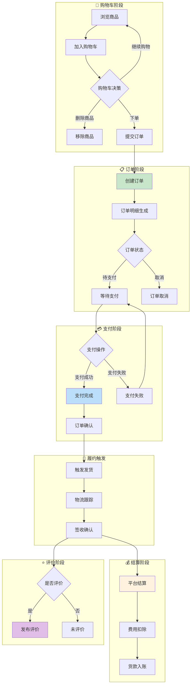

# 交易域完整梳理文档	

> **数据域**: 交易域 (trd)	
> **优先级**: P0（核心域）	
> **版本**: v2.0	
> **创建日期**: 2026-01-20	
> **负责人**: 徐恬	
> **分析部门**: 增长分析	

---

## 1. 域定义与业务全景	

### 1.1 域定义	

交易域覆盖跨境电商业务中从**购物车到订单完成**的全流程交易数据，是数据仓库的**核心数据域**，承载了电商业务的核心价值链。	

### 1.2 业务范围	

```
交易域核心：交易行为的全生命周期管理
├── 购物车阶段
│   ├── 加入购物车
│   └── 购物车管理（修改、删除）
├── 订单阶段
│   ├── 创建订单
│   ├── 订单明细
│   └── 订单状态变更
├── 支付阶段
│   ├── 支付发起
│   ├── 支付成功/失败
│   └── 退款处理
├── 结算阶段
│   ├── 平台结算
│   ├── 费用扣除
│   └── 货款入账
└── 评价阶段
    ├── 发布评价
    └── 评价管理
```

### 1.3 与相关域的边界澄清	

| 业务场景 | 交易域职责 | 其他域职责 |
|----------|-----------|-----------|
| 订单发货 | 记录订单状态变更为"已发货" | 履约域负责物流跟踪 |
| 库存扣减 | 订单创建触发库存预留 | 库存域负责实际库存变动 |
| 促销应用 | 记录促销优惠金额 | 促销域负责促销规则计算 |
| 广告转化 | 提供订单转化数据 | 广告域负责归因分析 |
| 财务对账 | 提供订单结算明细 | 财务域负责利润核算 |

> **关键澄清**：交易域记录**交易事件本身**，相关业务的深度分析由专属数据域负责。	

---

## 2. 业务流程图	



---

## 3. 业务过程定义	

### 3.1 业务流程→业务过程映射	

> **推导逻辑**：业务流程中的每个**可度量的关键事件节点**成为一个业务过程	

| 业务流程阶段 | 业务过程 | 英文名称 | 为什么是业务过程 |
|-------------|---------|----------|-----------------|
| 购物车 | 加入购物车 | add_to_cart | 用户意向的可度量事件，有明确时间和商品 |
| 订单 | 创建订单 | create_order | 交易的起点，有明确的订单号和金额 |
| 订单 | 订单明细 | order_detail | 订单的细化，精确到每个商品SKU |
| 支付 | 支付订单 | pay_order | 资金流动的关键事件，有明确的支付时间和金额 |
| 结算 | 结算订单 | settle_order | 收入确认的关键事件，有明确的结算金额 |
| 评价 | 发布评价 | submit_review | 用户反馈的可度量事件，有评分和内容 |

### 3.2 业务过程详细定义	

<table>
    <thead>
        <tr>
            <th>序号</th>
            <th>业务过程</th>
            <th>英文名称</th>
            <th>描述</th>
            <th>事实表类型</th>
            <th>粒度声明</th>
            <th>主键组成</th>
        </tr>
    </thead>
    <tbody>
        <tr>
            <td>1</td>
            <td>加入购物车</td>
            <td>add_to_cart</td>
            <td>用户将商品加入购物车的行为</td>
            <td>事务事实</td>
            <td>每一行代表一次用户将某商品加入购物车的行为</td>
            <td>购物车ID + 商品ASIN + 时间戳</td>
        </tr>
        <tr>
            <td>2</td>
            <td>创建订单</td>
            <td>create_order</td>
            <td>用户提交订单的行为</td>
            <td>事务事实</td>
            <td>每一行代表一笔订单的创建事件</td>
            <td>订单ID</td>
        </tr>
        <tr>
            <td>3</td>
            <td>订单明细</td>
            <td>order_detail</td>
            <td>订单中每个商品明细</td>
            <td>事务事实</td>
            <td>每一行代表一笔订单中的一个商品明细</td>
            <td>订单ID + 订单明细行号</td>
        </tr>
        <tr>
            <td>4</td>
            <td>支付订单</td>
            <td>pay_order</td>
            <td>用户完成订单支付</td>
            <td>事务事实</td>
            <td>每一行代表一笔订单的一次支付事件</td>
            <td>订单ID + 支付ID</td>
        </tr>
        <tr>
            <td>5</td>
            <td>结算订单</td>
            <td>settle_order</td>
            <td>平台完成订单结算</td>
            <td>事务事实</td>
            <td>每一行代表一笔订单的一次平台结算记录</td>
            <td>订单ID + 结算ID</td>
        </tr>
        <tr>
            <td>6</td>
            <td>发布评价</td>
            <td>submit_review</td>
            <td>用户对订单发表评价</td>
            <td>事务事实</td>
            <td>每一行代表一条用户评价记录</td>
            <td>评价ID</td>
        </tr>
    </tbody>
</table>

---

## 4. 维度设计	

### 4.1 维度推导逻辑	

> **推导原则**：维度来源于回答"谁/什么/何时/何地/为何"等分析问题	

| 分析问题 | 对应维度 | 维度类型 |
|----------|---------|----------|
| 什么时候下单/支付/结算？ | 时间维度 | 公共维度 |
| 什么商品？ | 产品维度 | 公共维度 |
| 哪个SKU变体？ | 变体维度 | 公共维度 |
| 哪个店铺？ | 店铺维度 | 公共维度 |
| 哪个站点市场？ | 站点维度 | 公共维度 |
| 哪个类目？ | 类目维度 | 公共维度 |
| 用什么方式支付？ | 支付方式维度 | 专属维度 |
| 订单当前状态？ | 订单状态维度 | 专属维度 |
| 评价是几星？ | 评价等级维度 | 专属维度 |
| 订单来自什么渠道？ | 订单渠道维度 | 专属维度 |

### 4.2 维度清单	

#### 公共维度	

| 维度 | 英文名称 | 使用场景 |
|------|----------|----------|
| ✓ 时间维度 | dim_date | 所有业务过程 |
| ✓ 产品维度 | dim_product | 订单明细、评价 |
| ✓ 变体维度 | dim_variant | 订单明细 |
| ✓ 店铺维度 | dim_store | 订单、支付、结算 |
| ✓ 站点维度 | dim_marketplace | 订单、支付、结算 |
| ✓ 类目维度 | dim_category | 订单明细 |

#### 专属维度	

| 编号 | 维度名称 | 英文名称 | 主键 | 说明 |
|------|----------|----------|------|------|
| DIM-01 | 支付方式维度 | dim_payment_method | payment_method_key | 信用卡、礼品卡、COD、分期付款等 |
| DIM-02 | 订单状态维度 | dim_order_status | order_status_key | 待支付、已支付、已发货、已签收、已取消、已退款 |
| DIM-03 | 评价等级维度 | dim_review_rating | rating_key | 1-5星评级 |
| DIM-04 | 订单渠道维度 | dim_order_channel | order_channel_key | 自然流量、广告流量、促销活动、站外引流 |
| DIM-05 | 订单类型维度 | dim_order_type | order_type_key | 普通订单、FBA订单、FBM订单、B2B订单 |

---

## 5. 事实表设计	

### 5.1 事实表清单	

| 编号 | 事实表名称 | 英文表名 | 类型 | 更新频率 | 说明 |
|------|-----------|----------|------|----------|------|
| FCT-01 | 购物车事实表 | fct_trd_cart | 事务事实 | 实时 | 记录加购行为 |
| FCT-02 | 订单事实表 | fct_trd_order | 事务事实 | 实时/日 | 记录每笔订单创建事件 |
| FCT-03 | 订单明细事实表 | fct_trd_order_detail | 事务事实 | 实时/日 | 记录订单中每个商品明细 |
| FCT-04 | 支付事实表 | fct_trd_payment | 事务事实 | 实时/日 | 记录每笔支付事件 |
| FCT-05 | 结算事实表 | fct_trd_settlement | 事务事实 | 日 | 记录平台结算记录 |
| FCT-06 | 评价事实表 | fct_trd_review | 事务事实 | 日 | 记录用户评价 |
| FCT-07 | 订单履约累积快照 | fct_trd_order_fulfillment | 累积快照 | 实时/日 | 跟踪订单从创建到签收的全流程 |

### 5.2 度量指标	

| 指标名称 | 指标说明 | 聚合方式 | 来源事实表 |
|----------|----------|----------|-----------| 
| 加购次数 | 加入购物车的次数 | SUM | fct_trd_cart |
| 订单数 | 订单总数 | SUM | fct_trd_order |
| 订单金额 | 订单总金额（GMV） | SUM | fct_trd_order |
| 客单价 | 平均每笔订单金额 | AVG | fct_trd_order |
| 商品数量 | 订单中商品总数 | SUM | fct_trd_order_detail |
| 支付金额 | 支付总金额 | SUM | fct_trd_payment |
| 支付成功率 | 支付成功订单/总订单 | AVG | fct_trd_payment |
| 结算金额 | 平台结算总金额 | SUM | fct_trd_settlement |
| 平台费用 | 平台扣费总额 | SUM | fct_trd_settlement |
| 评价数 | 评价总数 | SUM | fct_trd_review |
| 平均评分 | 平均评价星级 | AVG | fct_trd_review |
| 好评率 | 4-5星评价占比 | AVG | fct_trd_review |

---

## 6. 总线矩阵	

### 6.1 总线矩阵推导逻辑	

> **推导过程**：对每个业务过程，判断哪些维度可以用于分析	

```
业务过程 + 维度 = 分析视角
例如：订单 + 时间 = 按时间分析订单趋势
      订单 + 店铺 = 按店铺分析订单表现
      订单明细 + 产品 = 按产品分析销售情况
```

### 6.2 交易域总线矩阵	

| 业务过程 | 时间 | 产品 | 变体 | 店铺 | 站点 | 类目 | 支付方式 | 订单状态 | 评价等级 | 订单渠道 | 订单类型 |
|----------|------|------|------|------|------|------|----------|----------|----------|----------|----------|
| 加入购物车 | ✓ | ✓ | ✓ | ✓ | ✓ | ✓ | | | | ✓ | |
| 创建订单 | ✓ | | | ✓ | ✓ | | | ✓ | | ✓ | ✓ |
| 订单明细 | ✓ | ✓ | ✓ | ✓ | ✓ | ✓ | | ✓ | | ✓ | ✓ |
| 支付订单 | ✓ | | | ✓ | ✓ | | ✓ | | | | ✓ |
| 结算订单 | ✓ | | | ✓ | ✓ | | | | | | ✓ |
| 发布评价 | ✓ | ✓ | | ✓ | ✓ | | | | ✓ | | |

### 6.3 总线矩阵解读	

- **时间维度**：所有业务过程都需要按时间分析趋势（日/周/月/季度/年）	
- **产品/变体维度**：仅订单明细和评价需要精确到商品级别	
- **店铺/站点维度**：所有业务过程都需要区分不同店铺和站点市场	
- **支付方式维度**：仅用于支付订单，分析不同支付方式的占比和成功率	
- **订单状态维度**：用于创建订单和订单明细，跟踪订单生命周期	
- **评价等级维度**：仅用于评价分析，关注好评率和差评原因	
- **订单渠道维度**：分析订单来源，关联广告和促销的转化效果	
- **订单类型维度**：区分FBA/FBM订单，分析不同履约模式的表现	

---

## 7. 跨域关联说明	

### 7.1 与履约域的关联	

| 交易域事件 | 关联履约域事件 | 关联方式 |
|-----------|---------------|----------|
| 订单发货 | 物流单创建 | 订单号关联 |
| 订单签收 | 物流签收 | 订单号关联 |
| 订单取消 | 物流拦截 | 订单号关联 |

### 7.2 与库存域的关联	

| 交易域事件 | 关联库存域事件 | 关联方式 |
|-----------|---------------|----------|
| 创建订单 | 库存预留 | SKU + 数量 |
| 订单取消 | 库存释放 | SKU + 数量 |
| 订单发货 | 销售出库 | 订单号关联 |

### 7.3 与促销域的关联	

| 交易域事件 | 关联促销域事件 | 关联方式 |
|-----------|---------------|----------|
| 创建订单 | 促销使用 | 促销活动ID |
| 订单明细 | 促销优惠 | 商品促销价 |

### 7.4 与广告域的关联	

| 交易域事件 | 关联广告域事件 | 关联方式 |
|-----------|---------------|----------|
| 创建订单 | 广告归因 | 点击归因 + 订单号 |
| 订单金额 | 广告ROI | 订单金额 vs 广告支出 |

### 7.5 与财务域的关联	

| 交易域事件 | 关联财务域事件 | 关联方式 |
|-----------|---------------|----------|
| 结算订单 | 收入确认 | 结算ID |
| 平台费用 | 费用核算 | 结算明细 |
| 退款金额 | 退款处理 | 订单号 + 退款ID |

---

## 更新记录	

| 版本 | 日期 | 更新内容 |
|------|------|----------|
| v1.0 | 2026-01-15 | 初始版本，简单梳理 |
| v1.1 | 2026-01-16 | 合并业务过程清单与粒度定义表格，添加负责人信息 |
| v2.0 | 2026-01-20 | 完整梳理版本，新增业务全景、业务流程图、维度推导逻辑、总线矩阵解读、跨域关联说明 |
