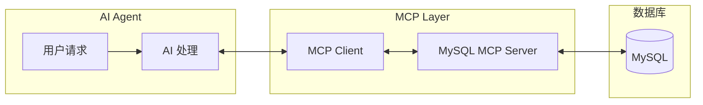
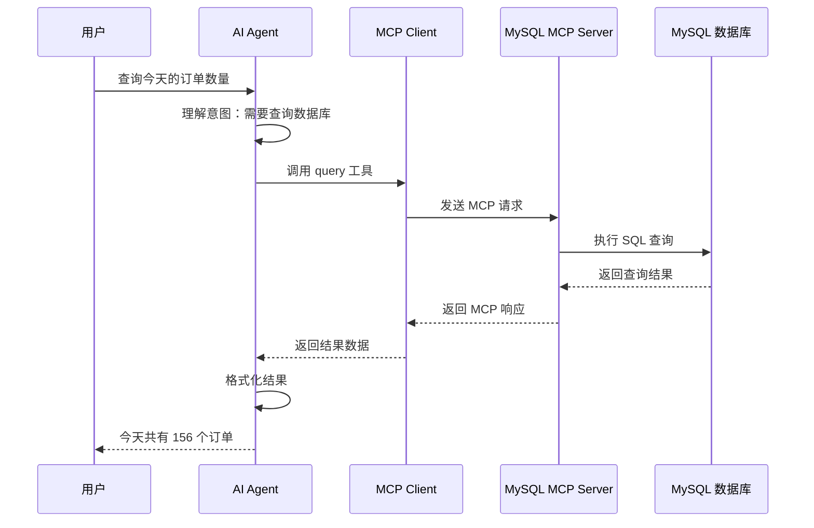
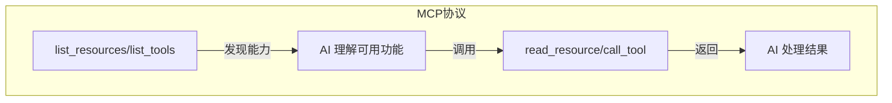
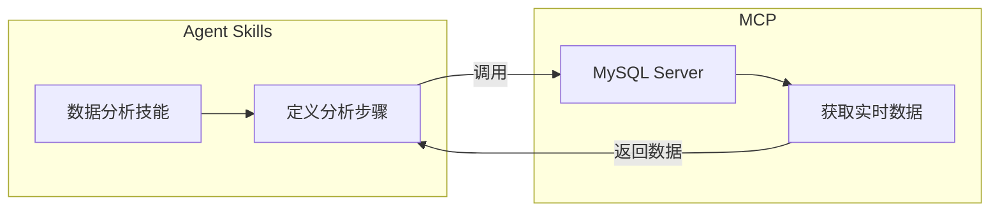

# MCP MySQL 连接示例教程

---
**文档版本**: v1.0  
**创建日期**: 2026-01-20  
**作者**: AI Assistant  
---

## 一、概述

本文档通过一个完整的 MySQL 连接示例，帮助你理解 MCP（Model Context Protocol）的工作原理和实际应用。	

### 1.1 目标

通过 MCP 让 AI 能够：
- 连接 MySQL 数据库
- 执行 SQL 查询
- 返回查询结果

### 1.2 架构图



---

## 二、MCP Server 代码示例

### 2.1 项目结构

```
mcp-mysql-server/
├── server.py              # MCP Server 主文件
├── config.py              # 配置文件
├── requirements.txt       # 依赖包
└── README.md             # 说明文档
```

### 2.2 依赖安装 (requirements.txt)

```txt
mcp>=1.0.0
mysql-connector-python>=8.0.0
python-dotenv>=1.0.0
```

### 2.3 配置文件 (config.py)

```python
import os
from dotenv import load_dotenv

# 加载环境变量
load_dotenv()

# MySQL 配置
MYSQL_CONFIG = {
    "host": os.getenv("MYSQL_HOST", "localhost"),
    "port": int(os.getenv("MYSQL_PORT", 3306)),
    "user": os.getenv("MYSQL_USER", "root"),
    "password": os.getenv("MYSQL_PASSWORD", ""),
    "database": os.getenv("MYSQL_DATABASE", "test_db"),
}
```

### 2.4 MCP Server 主文件 (server.py)

```python
"""
MCP MySQL Server - 让 AI 能够查询 MySQL 数据库
"""

import asyncio
import json
from typing import Any

import mysql.connector
from mcp.server import Server
from mcp.server.stdio import stdio_server
from mcp.types import (
    Resource,
    Tool,
    TextContent,
)

from config import MYSQL_CONFIG


# ============================================================
# 第一部分：创建 MCP Server 实例
# ============================================================

# 创建 Server 实例，定义名称
server = Server("mysql-mcp-server")


# ============================================================
# 第二部分：定义 Resources（资源）
# 资源是可读取的数据，类似于 REST API 的 GET 请求
# ============================================================

@server.list_resources()
async def list_resources() -> list[Resource]:
    """列出所有可用的资源"""
    return [
        Resource(
            uri="mysql://tables",
            name="数据库表列表",
            description="获取数据库中所有表的列表",
            mimeType="application/json",
        ),
        Resource(
            uri="mysql://schema/{table_name}",
            name="表结构",
            description="获取指定表的结构信息",
            mimeType="application/json",
        ),
    ]


@server.read_resource()
async def read_resource(uri: str) -> str:
    """读取资源内容"""
    
    if uri == "mysql://tables":
        # 获取所有表名
        tables = await execute_query("SHOW TABLES")
        return json.dumps(tables, ensure_ascii=False, indent=2)
    
    elif uri.startswith("mysql://schema/"):
        # 获取表结构
        table_name = uri.split("/")[-1]
        schema = await execute_query(f"DESCRIBE {table_name}")
        return json.dumps(schema, ensure_ascii=False, indent=2)
    
    raise ValueError(f"未知资源: {uri}")


# ============================================================
# 第三部分：定义 Tools（工具）
# 工具是可执行的操作，类似于 REST API 的 POST 请求
# ============================================================

@server.list_tools()
async def list_tools() -> list[Tool]:
    """列出所有可用的工具"""
    return [
        Tool(
            name="query",
            description="执行 SQL 查询语句（SELECT）",
            inputSchema={
                "type": "object",
                "properties": {
                    "sql": {
                        "type": "string",
                        "description": "要执行的 SQL 查询语句",
                    },
                    "limit": {
                        "type": "integer",
                        "description": "返回结果的最大行数，默认 100",
                        "default": 100,
                    },
                },
                "required": ["sql"],
            },
        ),
        Tool(
            name="execute",
            description="执行 SQL 修改语句（INSERT/UPDATE/DELETE）",
            inputSchema={
                "type": "object",
                "properties": {
                    "sql": {
                        "type": "string",
                        "description": "要执行的 SQL 语句",
                    },
                },
                "required": ["sql"],
            },
        ),
    ]


@server.call_tool()
async def call_tool(name: str, arguments: dict[str, Any]) -> list[TextContent]:
    """执行工具调用"""
    
    if name == "query":
        # 执行查询
        sql = arguments["sql"]
        limit = arguments.get("limit", 100)
        
        # 安全检查：只允许 SELECT
        if not sql.strip().upper().startswith("SELECT"):
            return [TextContent(
                type="text",
                text="错误：query 工具只支持 SELECT 语句"
            )]
        
        # 添加 LIMIT
        if "LIMIT" not in sql.upper():
            sql = f"{sql} LIMIT {limit}"
        
        result = await execute_query(sql)
        return [TextContent(
            type="text",
            text=json.dumps(result, ensure_ascii=False, indent=2)
        )]
    
    elif name == "execute":
        # 执行修改
        sql = arguments["sql"]
        
        # 安全检查：禁止 DROP/TRUNCATE
        forbidden = ["DROP", "TRUNCATE", "ALTER"]
        if any(word in sql.upper() for word in forbidden):
            return [TextContent(
                type="text",
                text=f"错误：禁止执行 {forbidden} 操作"
            )]
        
        affected_rows = await execute_modify(sql)
        return [TextContent(
            type="text",
            text=f"执行成功，影响行数：{affected_rows}"
        )]
    
    raise ValueError(f"未知工具: {name}")


# ============================================================
# 第四部分：数据库操作辅助函数
# ============================================================

async def execute_query(sql: str) -> list[dict]:
    """执行查询并返回结果"""
    def _query():
        conn = mysql.connector.connect(**MYSQL_CONFIG)
        cursor = conn.cursor(dictionary=True)
        cursor.execute(sql)
        result = cursor.fetchall()
        cursor.close()
        conn.close()
        return result
    
    # 在线程池中执行阻塞操作
    loop = asyncio.get_event_loop()
    return await loop.run_in_executor(None, _query)


async def execute_modify(sql: str) -> int:
    """执行修改并返回影响行数"""
    def _modify():
        conn = mysql.connector.connect(**MYSQL_CONFIG)
        cursor = conn.cursor()
        cursor.execute(sql)
        conn.commit()
        affected = cursor.rowcount
        cursor.close()
        conn.close()
        return affected
    
    loop = asyncio.get_event_loop()
    return await loop.run_in_executor(None, _modify)


# ============================================================
# 第五部分：启动 Server
# ============================================================

async def main():
    """启动 MCP Server"""
    async with stdio_server() as (read_stream, write_stream):
        await server.run(
            read_stream,
            write_stream,
            server.create_initialization_options()
        )


if __name__ == "__main__":
    asyncio.run(main())
```

---

## 三、配置 MCP Client

### 3.1 配置文件位置

在 AI Agent 的配置文件中添加 MCP Server：

**Windows 路径**：
```
%APPDATA%\Claude\claude_desktop_config.json
```

**macOS 路径**：
```
~/Library/Application Support/Claude/claude_desktop_config.json
```

### 3.2 配置内容

```json
{
  "mcpServers": {
    "mysql": {
      "command": "python",
      "args": ["D:/path/to/mcp-mysql-server/server.py"],
      "env": {
        "MYSQL_HOST": "localhost",
        "MYSQL_PORT": "3306",
        "MYSQL_USER": "your_username",
        "MYSQL_PASSWORD": "your_password",
        "MYSQL_DATABASE": "your_database"
      }
    }
  }
}
```

### 3.3 配置说明

| 字段 | 说明 |
|------|------|
| `command` | 执行 Server 的命令（python） |
| `args` | Server 脚本的路径 |
| `env` | 环境变量（数据库连接信息） |

---

## 四、使用示例

### 4.1 完整交互流程



### 4.2 对话示例

**用户**：
```
帮我查询一下销售表中今天的订单数量
```

**AI 内部处理**：
```
1. 理解意图：查询订单数量
2. 识别工具：MySQL MCP Server 的 query 工具
3. 构造 SQL：SELECT COUNT(*) as count FROM orders WHERE DATE(created_at) = CURDATE()
4. 调用 MCP 工具
```

**AI 调用 MCP**：
```json
{
  "tool": "query",
  "arguments": {
    "sql": "SELECT COUNT(*) as count FROM orders WHERE DATE(created_at) = CURDATE()",
    "limit": 1
  }
}
```

**MCP 返回**：
```json
[
  {"count": 156}
]
```

**AI 回复**：
```
根据查询结果，今天共有 156 个订单。
```

### 4.3 更多使用场景

| 场景 | 用户请求 | AI 调用的 MCP 工具 |
|------|----------|-------------------|
| 查询数据 | "今天销售额多少？" | query（SELECT SUM...） |
| 查看表结构 | "订单表有哪些字段？" | read_resource（schema） |
| 插入数据 | "记录一条新订单" | execute（INSERT...） |
| 更新数据 | "把这个订单状态改为已完成" | execute（UPDATE...） |

---

## 五、安全最佳实践

### 5.1 权限控制

```python
# 1. 只读账号 - 推荐用于查询场景
MYSQL_USER = "readonly_user"

# 2. SQL 白名单 - 限制可执行的操作类型
ALLOWED_OPERATIONS = ["SELECT"]
FORBIDDEN_OPERATIONS = ["DROP", "TRUNCATE", "ALTER", "CREATE"]

# 3. 表白名单 - 限制可访问的表
ALLOWED_TABLES = ["orders", "products", "customers"]
```

### 5.2 敏感信息保护

```python
# ❌ 错误做法：硬编码密码
password = "my_secret_password"

# ✅ 正确做法：使用环境变量
password = os.getenv("MYSQL_PASSWORD")

# ✅ 更好做法：使用密钥管理服务
from vault_client import get_secret
password = get_secret("mysql/password")
```

### 5.3 SQL 注入防护

```python
# ❌ 错误做法：直接拼接 SQL
sql = f"SELECT * FROM users WHERE name = '{user_input}'"

# ✅ 正确做法：使用参数化查询
sql = "SELECT * FROM users WHERE name = %s"
cursor.execute(sql, (user_input,))
```

---

## 六、MCP 核心概念总结

通过这个 MySQL 示例，我们可以理解 MCP 的三大核心概念：

### 6.1 Resources（资源）

```python
@server.list_resources()      # 列出可用资源
@server.read_resource()       # 读取资源内容
```

- **定位**：类似 REST API 的 GET
- **用途**：获取静态或动态数据
- **示例**：表列表、表结构

### 6.2 Tools（工具）

```python
@server.list_tools()          # 列出可用工具
@server.call_tool()           # 执行工具调用
```

- **定位**：类似 REST API 的 POST
- **用途**：执行操作、修改数据
- **示例**：执行 SQL 查询、插入数据

### 6.3 工作流程



---

## 七、与 Agent Skills 的结合

MCP 提供了"能力"，Skills 提供了"流程"，两者可以结合使用：



**组合示例**：
1. 用户请求"分析本月销售趋势"
2. AI 加载"数据分析技能"（Skills）获取执行步骤
3. AI 通过 MySQL MCP Server 查询销售数据（MCP）
4. AI 按照 Skills 定义的步骤分析数据
5. AI 使用 Skills 的模板生成报告

---

## 八、常见问题

### Q1：MCP Server 需要一直运行吗？

**答**：不需要。AI Agent 会在需要时自动启动 MCP Server，使用完毕后自动关闭。

### Q2：一个 AI Agent 可以连接多个 MCP Server 吗？

**答**：可以。只需在配置文件中添加多个 Server 配置：

```json
{
  "mcpServers": {
    "mysql": { ... },
    "postgres": { ... },
    "slack": { ... }
  }
}
```

### Q3：MCP 和直接调用 API 有什么区别？

**答**：
- MCP 是标准化协议，AI 无需了解具体 API 细节
- MCP 提供统一的发现机制（list_tools/list_resources）
- MCP 便于管理和扩展

---

## 版本记录

| 版本 | 日期 | 修改人 | 修改内容 |
|------|------|--------|----------|
| v1.0 | 2026-01-20 | AI Assistant | 初始创建 |
