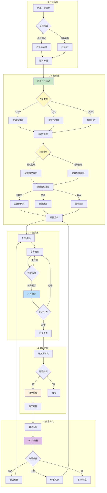

# 广告域业务流程图对比分析	

> **分析目标**: 对比权威流程图与数据域文档中的业务流程图差异，明确是否需要调整及如何调整	
> **分析日期**: 2026-01-21	

---

## 1. 三个流程图的核心结构对比	

### 1.1 权威资料：广告创建业务流程图	

**核心流程结构**：	
```
用户 → 创建广告请求 → 创建计广告
                         ├── 填写内容 → 投放策略选择 ──┬── 自动投放 → 完成设置
                         │                              └── 手动投放 → 投放位置 ──┬── 自动筛选
                         │                                                          └── 手动筛选
                         ├── 选择广告模式 ──┬── 商品模式 → 设置广告创意 → 设置投放渠道
                         │                   └── 视频模式 → 设置广告创意 → 设置投放渠道
                         └── 编辑信息 → 授权广告 → 付费类型选择 ──┬── VCPM签约化
                                                                    ├── CPC按效果付费
                                                                    └── CPC竞价量
                         → 广告类型(垂类/通投) → 解约方选择 → 添加推广产品 → 设定投放规则
```

**关键分支节点**：	
| 分支点   | 选项                                    |
| -------- | --------------------------------------- |
| 投放策略 | 自动投放、手动投放                      |
| 投放位置 | 自动筛选、手动筛选                      |
| 广告模式 | 商品、视频                              |
| 付费类型 | VCPM-签约化、CPC-按效果付费、CPC-竞价量 |
| 广告类型 | 垂类、通投                              |


### 1.2 权威资料：后台操作流程图	

**包含两个子流程**：	

**子流程A - 后台操作流程**：	
```
入口 → 创建计划 → 选择计划属性 → 设置方案 → 选择执行方案 
     → 方案设置 → 设置子方案 → 添加子任务 → 设置投放时间 
     → 创意设置 ──┬── 图文创意设置 ──┐
                   └── 视频创意设置 ──┴── 落地页设置 → 设置落地页链接 → 验证链接 → 提交审核
```

**子流程B - 用户操作流程**：	
```
用户 → 创建广告请求 → 选择广告类型 ──┬── 品牌广告 → 设置品牌信息 ──┐
                                        ├── 效果广告 → 设置推广目标 ──┼── 选择投放位置
                                        └── 商品广告 → 选择商品     ──┘
     → 付费方式 ──┬── CPM计费 ──┐
                   ├── CPC计费 ──┼── 定向设置 ──┬── 兴趣定向 ──┐
                   └── OCPC计费 ──┘              ├── 行为定向 ──┼── 预算设置 → 设置日预算 → 设置出价 → 确认创建
                                                  └── 地域定向 ──┘
```

**关键分支节点**：	
| 分支点   | 选项                         |
| -------- | ---------------------------- |
| 创意设置 | 图文创意、视频创意           |
| 广告类型 | 品牌广告、效果广告、商品广告 |
| 付费方式 | CPM、CPC、OCPC               |
| 人群定向 | 兴趣定向、行为定向、地域定向 |


### 1.3 数据域文档：当前业务流程图	

**当前流程结构**：	
```
📋 广告策略: 确定广告目标 → 目标类型(品牌曝光/商品销售) → 选择SB/SD/SP → 预算分配
          ↓
🎯 广告创建: 创建广告活动 → 创建广告组 → 投放类型(关键词/商品/受众) → 设置竞价
          ↓
🚀 广告投放: 广告上线 → 参与竞价 → 竞价结果 → 广告曝光 → 用户行为(点击/忽略)
          ↓
💰 转化归因: 进入详情页 → 是否购买 → 记录转化 → 归因计算
          ↓
📊 效果优化: 数据汇总 → ACOS分析 → 效果评估 → 增加预算/优化竞价/暂停调整
```

---

## 2. 核心差异分析	

### 2.1 流程覆盖范围差异	

<table>
    <thead>
        <tr>
            <th>阶段</th>
            <th>权威流程图覆盖</th>
            <th>数据域流程图覆盖</th>
            <th>差异说明</th>
        </tr>
    </thead>
    <tbody>
        <tr>
            <td>广告策略</td>
            <td>✓ 简略</td>
            <td>✓ 有</td>
            <td>基本一致</td>
        </tr>
        <tr>
            <td>广告创建</td>
            <td>✓ 详细（多个配置分支）</td>
            <td>✓ 简化（活动→组→竞价）</td>
            <td><strong>权威流程更详细</strong></td>
        </tr>
        <tr>
            <td>投放策略选择</td>
            <td>✓ 有（自动/手动）</td>
            <td>❌ 无</td>
            <td><strong>数据域缺失</strong></td>
        </tr>
        <tr>
            <td>创意设置</td>
            <td>✓ 有（图文/视频）</td>
            <td>❌ 无</td>
            <td><strong>数据域缺失</strong></td>
        </tr>
        <tr>
            <td>付费类型选择</td>
            <td>✓ 有（CPM/CPC/OCPC/VCPM）</td>
            <td>❌ 无</td>
            <td><strong>数据域缺失</strong></td>
        </tr>
        <tr>
            <td>定向设置</td>
            <td>✓ 有（兴趣/行为/地域）</td>
            <td>❌ 无</td>
            <td><strong>数据域缺失</strong></td>
        </tr>
        <tr>
            <td>落地页设置</td>
            <td>✓ 有</td>
            <td>❌ 无</td>
            <td><strong>数据域缺失</strong></td>
        </tr>
        <tr>
            <td>审核流程</td>
            <td>✓ 有（提交审核）</td>
            <td>❌ 无</td>
            <td><strong>数据域缺失</strong></td>
        </tr>
        <tr>
            <td>广告投放（竞价、曝光）</td>
            <td>❌ 无</td>
            <td>✓ 有</td>
            <td>数据域更详细</td>
        </tr>
        <tr>
            <td>转化归因</td>
            <td>❌ 无</td>
            <td>✓ 有</td>
            <td>数据域更详细</td>
        </tr>
        <tr>
            <td>效果优化</td>
            <td>❌ 无</td>
            <td>✓ 有</td>
            <td>数据域更详细</td>
        </tr>
    </tbody>
</table>

### 2.2 差异性质判断	

> [!IMPORTANT]
> **关键发现**：两边流程图的侧重点不同	
> - **权威流程图**：侧重于广告**创建配置阶段**（前端操作），详细描述各种配置选项	
> - **数据域流程图**：侧重于广告**投放效果阶段**（后端数据），详细描述投放后的数据流转	

这不是"错误"，而是**两边覆盖的业务阶段不同**。	

---

## 3. 是否需要调整？	

### 3.1 评估标准	

数据域文档的业务流程图应该覆盖**所有产生可度量数据的业务节点**。	

判断依据：权威流程图中的节点是否会产生需要追踪/分析的数据？	

### 3.2 逐项评估	

<table>
    <thead>
        <tr>
            <th>权威流程中的节点</th>
            <th>是否产生可度量数据</th>
            <th>是否需要纳入数据域流程</th>
        </tr>
    </thead>
    <tbody>
        <tr>
            <td>投放策略选择（自动/手动）</td>
            <td>✓ 是，配置属性</td>
            <td>🟡 可选：作为广告活动的属性维度即可</td>
        </tr>
        <tr>
            <td>创意设置（图文/视频）</td>
            <td>✓ 是，创意是独立实体</td>
            <td>🔴 <strong>建议纳入</strong>：创意与广告效果强相关</td>
        </tr>
        <tr>
            <td>付费类型（CPM/CPC/OCPC）</td>
            <td>✓ 是，影响计费逻辑</td>
            <td>🔴 <strong>建议纳入</strong>：需按付费类型分析ACOS</td>
        </tr>
        <tr>
            <td>定向设置（兴趣/行为/地域）</td>
            <td>✓ 是，定向策略配置</td>
            <td>🟡 可选：作为定向类型维度即可</td>
        </tr>
        <tr>
            <td>落地页设置</td>
            <td>✓ 是，落地页URL配置</td>
            <td>🟡 可选：可作为广告组属性</td>
        </tr>
        <tr>
            <td>提交审核</td>
            <td>✓ 是，审核状态变更</td>
            <td>🟡 可选：已有广告状态维度可覆盖</td>
        </tr>
    </tbody>
</table>

### 3.3 调整建议	

> [!NOTE]
> **保守建议**：数据域流程图**不需要大改**，但需要在"广告创建"阶段补充几个关键配置节点	

**调整方案**：在现有流程图的"广告创建"阶段，增加以下节点：	
1. 选择付费类型（CPM/CPC/OCPC）	
2. 设置广告创意（图文/视频）	

**不需要改动的部分**：	
- 投放策略（自动/手动）→ 作为维度属性即可	
- 定向设置 → 作为维度属性即可	
- 落地页、审核 → 现有广告状态维度可覆盖	

---

## 4. 建议调整后的流程图	

### 4.1 最小化调整方案	

只在"广告创建"阶段增加两个节点：	



---

## 5. 对后续结论的影响评估	

### 5.1 如果采用最小化调整方案	

| 影响范围     | 是否需要修改 | 修改内容                           |
| ------------ | ------------ | ---------------------------------- |
| 业务过程定义 | 🟡 可选       | 可保持现有6个业务过程不变          |
| 维度设计     | 🔴 需要       | 新增"付费类型维度"、"创意类型维度" |
| 事实表设计   | 🟢 无需       | 现有事实表可承载新增维度           |
| 总线矩阵     | 🔴 需要       | 将新增维度加入矩阵                 |

### 5.2 结论	

> **流程图调整建议**：最小化改动，只在"广告创建"阶段增加"付费类型"和"创意类型"两个选择节点	
> **对后续影响**：主要影响是需要新增2个维度（付费类型、创意类型），其他保持不变	

---

## 版本记录	

| 版本 | 日期       | 更新内容                 |
| ---- | ---------- | ------------------------ |
| v1.0 | 2026-01-21 | 初始版本，流程图对比分析 |
