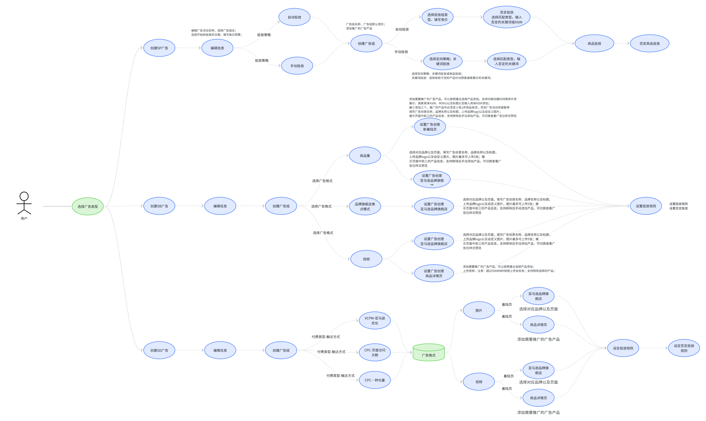
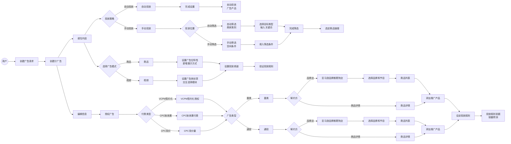
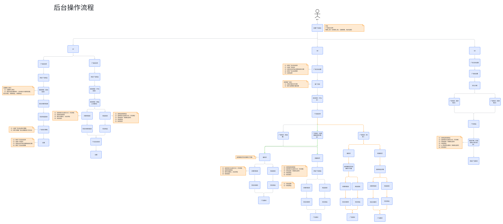
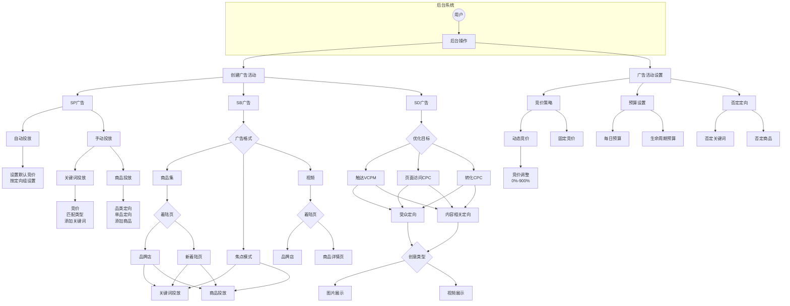

# 创建流程图  

> 来源: 广告业务流程-创建 / 创建流程图  

---

## 流程图1：广告创建业务流程

### 原始图片

### Mermaid流程图

---

## 流程图2：后台操作流程

### 原始图片

### Mermaid流程图

---

## 流程说明

### 流程图1：广告创建业务流程

1. **入口流程**: 用户发起创建广告请求
2. **投放策略**: 自动投放/手动投放
3. **广告模式**: 商品模式/视频模式
4. **付费类型**: VCPM/CPC
5. **广告类型**: 垂类/通投

### 流程图2：后台操作流程

1. **广告类型**: SP广告、SB广告、SD广告
2. **SP广告**: 自动投放、手动投放（关键词/商品）
3. **SB广告**: 商品集、焦点模式、视频
4. **SD广告**: 触达、页面访问、转化
5. **活动设置**: 竞价策略、预算设置、否定定向

---

## 版本记录

| 版本 | 日期       | 修改内容                                      | 修改人 |
| ---- | ---------- | --------------------------------------------- | ------ |
| v1.1 | 2026-01-21 | 补充第二张流程图（后台操作流程）的Mermaid代码 | AI助手 |
| v1.0 | 2026-01-21 | 从Excel提取并添加第一张流程图Mermaid          | AI助手 |
