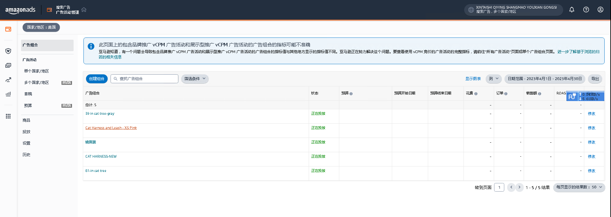
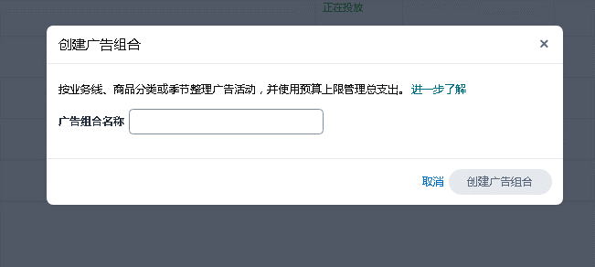
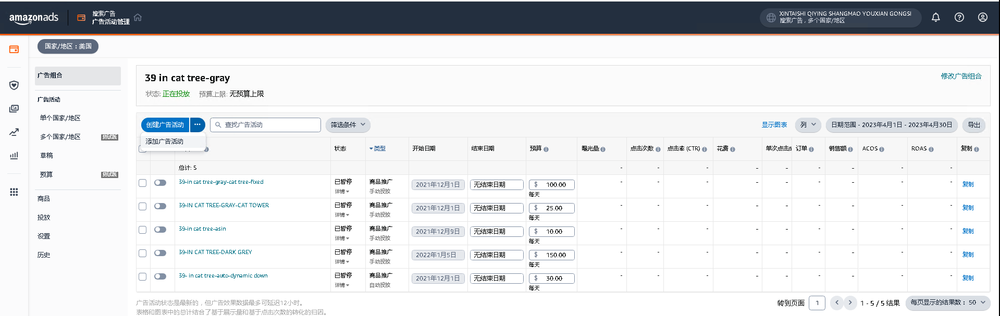
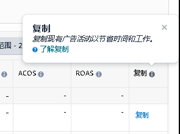
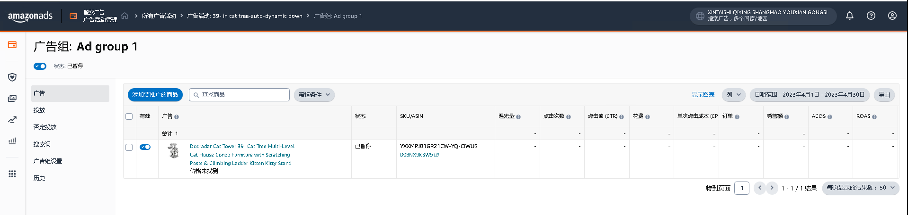

# 广告管理界面[隐藏]  

> 来源: 广告业务流程-创建 / 广告管理界面  

### 广告管理界面 [隐藏]  

### 图片内容  

  

  

  

  

  

  

  

  

  

  

  

  

  

> ⚠️ **注意**：上述图片需要根据 `图片识别.md` 的规则进行进一步识别处理。  

| 1、广告组合 |  |  |
|---|---|---|
|  |  |  |
|  |  |  |
|  |  |  |
|  |  |  |
|  |  |  |
|  |  |  |
|  |  |  |
|  |  |  |
|  |  |  |
|  |  |  |
|  |  |  |
|  |  |  |
|  |  |  |
|  |  |  |
|  |  |  |
|  |  |  |
|  |  |  |
|  |  |  |
|  |  |  |
|  |  |  |
|  |  |  |
|  |  |  |
|  |  |  |
|  |  |  |
|  |  |  |
|  |  |  |
|  |  |  |
|  |  |  |
|  |  |  |
|  |  |  |
|  |  |  |
|  |  |  |
|  |  |  |
|  |  |  |
|  |  |  |
|  |  |  |
|  |  |  |
| 1.1 创建广告组合 |  |  |
|  |  |  |
|  |  |  |
|  |  |  |
|  |  |  |
|  |  |  |
|  |  |  |
|  |  |  |
|  |  |  |
|  |  |  |
|  |  |  |
|  |  |  |
|  |  |  |
|  |  |  |
|  |  |  |
|  |  |  |
|  |  |  |
|  |  |  |
|  |  |  |
| 1.2 修改 |  |  |
|  |  |  |
|  |  |  |
|  |  |  |
|  |  |  |
|  |  |  |
|  |  |  |
|  |  |  |
|  |  |  |
|  |  |  |
|  |  |  |
|  |  |  |
|  |  |  |
|  |  |  |
|  |  |  |
|  |  |  |
|  |  |  |
|  |  |  |
|  |  |  |
|  |  |  |
|  |  |  |
|  |  |  |
|  |  |  |
|  |  |  |
|  |  |  |
|  |  |  |
|  |  |  |
|  |  |  |
|  |  |  |
|  |  |  |
|  |  |  |
| 1.3 涉及字段： |  |  |
| 广告组合 | 可点击 |  |
| 状态 |  |  |
| 预算 |  |  |
| 预算开始日期 |  |  |
| 预算结束日期 |  |  |
| 曝光量 |  |  |
| 点击次数 |  |  |
| 点击率 (CTR) |  |  |
| 花费 |  |  |
| 单次点击成本 (CPC) |  |  |
| 订单 |  |  |
| 销售额 |  |  |
| 广告投入产出比 (ACOS) |  |  |
| 广告支出回报 (ROAS) |  |  |
| “品牌新买家”订单数量 |  |  |
| “品牌新买家”订单百分比 |  |  |
| “品牌新买家”销售额 |  |  |
| “品牌新买家”销售额百分比 |  |  |
| 操作 | 注：1.2修改 |  |
|  |  |  |
|  |  |  |
| 1.4 点击广告组合 |  |  |
|  |  |  |
|  |  |  |
|  |  |  |
|  |  |  |
|  |  |  |
|  |  |  |
|  |  |  |
|  |  |  |
|  |  |  |
|  |  |  |
|  |  |  |
|  |  |  |
|  |  |  |
|  |  |  |
|  |  |  |
|  |  |  |
|  |  |  |
|  |  |  |
|  |  |  |
|  |  |  |
|  |  |  |
|  |  |  |
|  |  |  |
|  |  |  |
|  |  |  |
|  |  |  |
|  |  |  |
|  |  |  |
|  |  |  |
|  |  |  |
|  |  |  |
|  |  |  |
|  |  |  |
|  |  |  |
|  |  |  |
|  |  |  |
|  |  |  |
| 涉及字段： |  | 1.4.1 可添加广告活动 |
| 有效 |  | 1.4.2 可开启暂停广告活动（有效） |
| 广告活动 |  | 1.4.3 可添加结束日期 |
| 状态 |  | 1.4.4可修改预算 |
| 类型 |  | 1.4.5 可复制广告活动 |
| 开始日期 |  |  |
| 结束日期 |  |  |
| 预算 |  |  |
| 费用类型 |  |  |
| 曝光量 |  |  |
| 搜索结果首页首位展示量份额 (IS) |  |  |
| 点击次数 |  |  |
| 点击率 (CTR) |  |  |
| 花费 |  |  |
| 单次点击成本 (CPC) |  |  |
| 订单 |  |  |
| 销售额 |  |  |
| 广告投入产出比 (ACOS) |  |  |
| 广告支出回报 (ROAS) |  |  |
| “品牌新买家”订单数量 |  |  |
| “品牌新买家”订单百分比 |  |  |
| “品牌新买家”销售额 |  |  |
| “品牌新买家”销售额百分比 |  |  |
| 每 1,000 次可见展示次数的成本 (VCPM) |  |  |
| 可见展示次数 |  |  |
| 视频播放至四分之一的次数 |  |  |
| 视频播放至一半的次数 |  |  |
| 视频播放至四分之三的次数 |  |  |
| 视频完整播放的次数 |  |  |
| 视频取消静音 |  |  |
| 浏览率 (VTR) |  |  |
| 观看点击率 (vCTR) |  |  |
| 复制 |  |  |
|  |  |  |
|  |  |  |
|  |  |  |
|  |  |  |
|  |  |  |
|  |  |  |
|  |  |  |
|  |  |  |
|  |  |  |
|  |  |  |
|  |  |  |
|  |  |  |
|  |  |  |
|  |  |  |
|  |  |  |
|  |  |  |
|  |  |  |
|  |  |  |
|  |  |  |
|  |  |  |
|  |  |  |
|  |  |  |
|  |  |  |
|  |  |  |
|  |  |  |
|  |  |  |
|  |  |  |
|  |  |  |
|  |  |  |
|  |  |  |
|  |  |  |
|  |  |  |
|  |  |  |
|  |  |  |
|  |  |  |
|  |  |  |
|  |  |  |
|  |  |  |
|  |  |  |
|  |  |  |
|  |  |  |
|  |  |  |
|  |  |  |
|  |  |  |
|  |  |  |
|  |  |  |
|  |  |  |
|  |  |  |
|  |  |  |
|  |  |  |
| 1.5 点击广告活动 |  |  |
|  |  |  |
| SP广告活动-广告组 |  |  |
|  |  |  |
| 涉及字段： |  |  |
| 有效 |  |  |
| 广告组 |  |  |
| 状态 |  |  |
| 建议竞价 |  |  |
| 默认竞价 |  |  |
| 定位总数 |  |  |
| 商品 |  |  |
| 曝光量 |  |  |
| 点击次数 |  |  |
| 点击率 (CTR) |  |  |
| 花费 |  |  |
| 单次点击成本 (CPC) |  |  |
| 订单 |  |  |
| 销售额 |  |  |
| 广告投入产出比 (ACOS) |  |  |
| 广告支出回报 (ROAS) |  |  |
|  |  |  |
|  |  |  |
|  |  |  |
|  |  |  |
|  |  |  |
|  |  |  |
| SP广告活动-广告组-推广商品 |  |  |
|  |  |  |
| 涉及字段： |  |  |
| 有效 |  |  |
| 广告 |  |  |
| 状态 |  |  |
| SKU/ASIN |  |  |
| 曝光量 |  |  |
| 点击次数 |  |  |
| 点击率 (CTR) |  |  |
| 花费 |  |  |
| 单次点击成本 (CPC) |  |  |
| 订单 |  |  |
| 销售额 |  |  |
| 广告投入产出比 (ACOS) |  |  |
| 广告支出回报 (ROAS) |  |  |
|  |  |  |
|  |  |  |
|  |  |  |
|  |  |  |
|  |  |  |
|  |  |  |
|  |  |  |
|  |  |  |
|  |  |  |
|  |  |  |
|  |  |  |
|  |  |  |
| SP广告活动-广告组-投放 |  |  |
|  |  |  |
| 涉及字段： |  |  |
| 有效 |  |  |
| 投放对象 |  |  |
| 匹配类型 |  |  |
| 状态 |  |  |
| 匹配类型 |  |  |
| 建议竞价 |  |  |
| 曝光量 |  |  |
| 搜索结果首页首位展示量份额 (IS) |  |  |
| 点击次数 |  |  |
| 点击率 (CTR) |  |  |
| 花费 |  |  |
| 单次点击成本 (CPC) |  |  |
| 订单 |  |  |
| 销售额 |  |  |
| 广告投入产出比 (ACOS) |  |  |
| 广告支出回报 (ROAS) |  |  |

