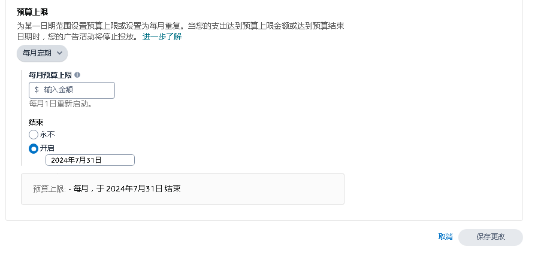
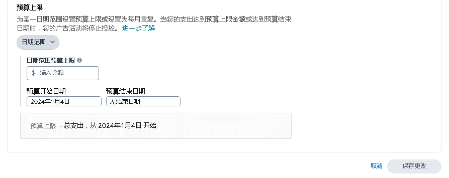

# 广告组合创建  

> 来源: 广告业务流程-创建 / 广告组合创建  

### 广告组合创建  

### 图片内容  

  

  

  

  

  

  

  

  

> ⚠️ **注意**：上述图片需要根据 `图片识别.md` 的规则进行进一步识别处理。  

<table>
  <thead>
    <tr>
      <th></th>
      <th></th>
      <th></th>
      <th></th>
    </tr>
  </thead>
  <tbody>
    <tr>
      <td colspan="4">创建广告组合</td>
    </tr>
    <tr>
      <td>步骤</td>
      <td>创建入口</td>
      <td colspan="2">修改</td>
    </tr>
    <tr>
      <td>步骤描述</td>
      <td>广告 → 广告活动管理 → 广告组合 → 创建组合</td>
      <td>广告组合名称</td>
      <td>预算上限</td>
    </tr>
    <tr>
      <td>图片</td>
      <td></td>
      <td></td>
      <td></td>
    </tr>
    <tr>
      <td>涉及数据</td>
      <td>广告组合 portfolioName</td>
      <td colspan="2"></td>
    </tr>
    <tr>
      <td>备注</td>
      <td></td>
      <td colspan="2"></td>
    </tr>
    <tr>
      <td></td>
      <td></td>
      <td></td>
      <td></td>
    </tr>
    <tr>
      <td>注：启动宏，alt+f8 执行“缩放图片”；关闭宏，alt+f8 执行“关闭缩放”</td>
      <td></td>
      <td></td>
      <td></td>
    </tr>
  </tbody>
</table>

