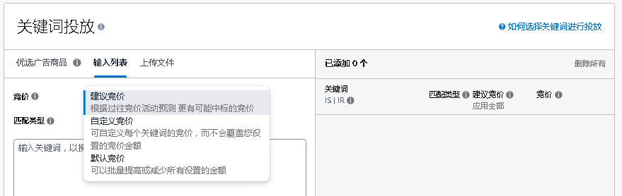

# SP广告-手动关键词投放  

> 来源: 广告业务流程-创建 / SP广告-手动关键词投放  

### SP广告-手动关键词投放  

### 图片内容  

  

  

  

  

  

  

  

  

  

  

  

  

  

> ⚠️ **注意**：上述图片需要根据 `图片识别.md` 的规则进行进一步识别处理。  

<table>
  <thead>
    <tr>
      <th>创建SP广告活动</th>
      <th></th>
      <th></th>
      <th></th>
      <th></th>
      <th></th>
      <th></th>
      <th></th>
      <th></th>
      <th></th>
      <th></th>
      <th></th>
    </tr>
  </thead>
  <tbody>
    <tr>
      <td colspan="2">编辑主题</td>
      <td>入口</td>
      <td colspan="6">广告组</td>
      <td colspan="3">广告活动</td>
    </tr>
    <tr>
      <td colspan="2">步骤</td>
      <td>创建入口</td>
      <td>1、 广告组设置</td>
      <td>2、添加商品</td>
      <td>3、定向策略</td>
      <td>4、手动投放</td>
      <td>5、关键词投放</td>
      <td>6、否定关键词投放</td>
      <td>7、广告活动竞价策略</td>
      <td>8、设置</td>
      <td>9、在其他国家/地区启动其他广告活动</td>
    </tr>
    <tr>
      <td colspan="2">步骤描述</td>
      <td>广告活动管理 → 单个国家/地区 → 创建广告活动 → 商品推广</td>
      <td>填写广告组名称</td>
      <td>添加广告商品</td>
      <td>选择需要投放的类型</td>
      <td>选择关键词投放</td>
      <td>（1）选择竞价生成的方式（可忽略） （2）选择匹配类型 （3）填写关键词，点击添加 （4）修改竞价</td>
      <td>（1）选择匹配类型 （2）添加关键词</td>
      <td>（1）选择广告活动竞价策略 （2）填写 根据广告位调整竞价 百分比</td>
      <td>（1）填写广告活动名称 （2）选择广告组合 （3）选择活动开始日期和结束日期 （4）填写广告活动预算</td>
      <td>（1）是否打开 （2）若打开请选择国家/地区 </td>
    </tr>
    <tr>
      <td colspan="2">图片</td>
      <td></td>
      <td></td>
      <td></td>
      <td></td>
      <td></td>
      <td></td>
      <td></td>
      <td></td>
      <td></td>
      <td></td>
    </tr>
    <tr>
      <td rowspan="12">涉及数据</td>
      <td>字段名称</td>
      <td>广告活动类型 campaignType</td>
      <td>广告组名称 adGroupName</td>
      <td>广告ASIN advertisedAsin</td>
      <td>投放类型 targetingType</td>
      <td>关键词或商品投放 keywordsOrProductsTargeting</td>
      <td>关键词 keyword</td>
      <td>否定关键词 negativeKeyword</td>
      <td>广告活动竞价策略 campaignBiddingStrategy</td>
      <td>广告活动 campaignName</td>
      <td></td>
    </tr>
    <tr>
      <td>值</td>
      <td>商品推广Sponsored Products 品牌推广Sponsored Brands 展示推广Sponsored Display Sponsored TV （简写 SP、SB、SD、STV）</td>
      <td>text</td>
      <td>text</td>
      <td>自动投放 Automatic targeting 手动投放 Manual targeting</td>
      <td>Keyword targeting 关键词投放 productTargeting 商品投放</td>
      <td>text</td>
      <td>text</td>
      <td>动态竞价-提升和降低 Dynamic bids - up and down 动态竞价-仅降低 Dynamic bids - down only 固定竞价 Fixed bids</td>
      <td>text</td>
      <td></td>
    </tr>
    <tr>
      <td>字段名称</td>
      <td></td>
      <td></td>
      <td>广告SKU advertisedSku</td>
      <td></td>
      <td></td>
      <td>匹配类型  matchType </td>
      <td>否定关键词匹配类型 negativeKeywordMatchtype</td>
      <td>广告位竞价调整 adjustBidsByPlacement</td>
      <td>广告组合 portfolioName</td>
      <td></td>
    </tr>
    <tr>
      <td>值</td>
      <td></td>
      <td></td>
      <td>text</td>
      <td></td>
      <td></td>
      <td>广泛 Broad 词组 Phrase 精准 Exact</td>
      <td>词组否定 Negative phrase 精准否定 Negative exact</td>
      <td>搜索结果页顶部(首页) Top of search (first page) 搜索结果位置 Rest of search 商品页面 Product pages</td>
      <td>text</td>
      <td></td>
    </tr>
    <tr>
      <td>字段名称</td>
      <td></td>
      <td></td>
      <td></td>
      <td></td>
      <td></td>
      <td>建议竞价  suggestedBid</td>
      <td></td>
      <td>广告位竞价调整百分比 adjustBidsPercentageByPlacement</td>
      <td>startDate&endDate 开始日期和结束日期</td>
      <td></td>
    </tr>
    <tr>
      <td>值</td>
      <td></td>
      <td></td>
      <td></td>
      <td></td>
      <td></td>
      <td>-</td>
      <td></td>
      <td>number</td>
      <td>date</td>
      <td></td>
    </tr>
    <tr>
      <td>字段名称</td>
      <td></td>
      <td></td>
      <td></td>
      <td></td>
      <td></td>
      <td>竞价 bid</td>
      <td></td>
      <td></td>
      <td>国家 Country</td>
      <td></td>
    </tr>
    <tr>
      <td>值</td>
      <td></td>
      <td></td>
      <td></td>
      <td></td>
      <td></td>
      <td>number</td>
      <td></td>
      <td></td>
      <td>text</td>
      <td></td>
    </tr>
    <tr>
      <td>字段名称</td>
      <td></td>
      <td></td>
      <td></td>
      <td></td>
      <td></td>
      <td></td>
      <td></td>
      <td></td>
      <td>广告活动预算 campaignBudgetAmount</td>
      <td></td>
    </tr>
    <tr>
      <td>值</td>
      <td></td>
      <td></td>
      <td></td>
      <td></td>
      <td></td>
      <td></td>
      <td></td>
      <td></td>
      <td>number</td>
      <td></td>
    </tr>
    <tr>
      <td>字段名称</td>
      <td></td>
      <td></td>
      <td></td>
      <td></td>
      <td></td>
      <td></td>
      <td></td>
      <td></td>
      <td>广告活动预算类型 campaignBudgetType</td>
      <td></td>
    </tr>
    <tr>
      <td>值</td>
      <td></td>
      <td></td>
      <td></td>
      <td></td>
      <td></td>
      <td></td>
      <td></td>
      <td></td>
      <td>默认值：Daily</td>
      <td></td>
    </tr>
  </tbody>
</table>

