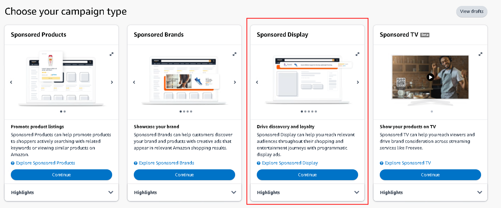
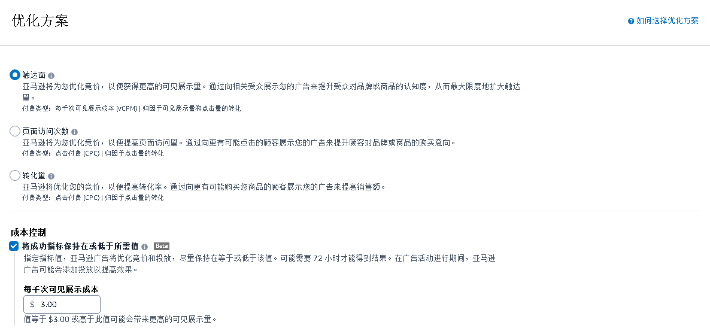
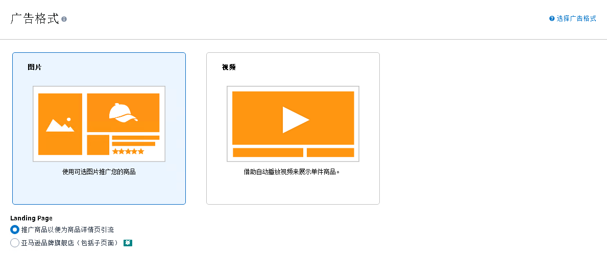

# SD广告-图片展示  

> 来源: 广告业务流程-创建 / SD广告-图片展示  

### SD广告-图片展示  

### 图片内容  

  

  

  

  

  

  

  

  

  

  

  

  

  

> ⚠️ **注意**：上述图片需要根据 `图片识别.md` 的规则进行进一步识别处理。  

<table>
  <thead>
    <tr>
      <th>创建SD广告活动</th>
      <th></th>
      <th></th>
      <th></th>
      <th></th>
      <th></th>
      <th></th>
      <th></th>
      <th></th>
      <th></th>
      <th></th>
    </tr>
  </thead>
  <tbody>
    <tr>
      <td colspan="2">编辑主题</td>
      <td>入口</td>
      <td>广告活动</td>
      <td colspan="7">广告组</td>
    </tr>
    <tr>
      <td colspan="2">步骤</td>
      <td>创建入口</td>
      <td>1、设置</td>
      <td>2、 广告组设置</td>
      <td>3、优化方案</td>
      <td>4、广告格式</td>
      <td>5、选择广告ASIN</td>
      <td>6、投放方案</td>
      <td>7、内容投放</td>
      <td>8、增添广告素材</td>
    </tr>
    <tr>
      <td colspan="2">步骤描述</td>
      <td>广告活动管理 → 单个国家/地区 → 创建广告活动 → 品牌推广</td>
      <td>（1）填写广告活动名称 （2）选择广告组合 （3）选择活动开始日期和结束日期 （4）填写广告活动预算</td>
      <td>填写广告组名称</td>
      <td>选择合适的优化方案</td>
      <td>（1）选择广告展示形式 （2）选择广告落地页</td>
      <td>（1）选择图片格式 （2）选择推广商品以便为商品详情页引流</td>
      <td>选择投放方案</td>
      <td>（1）选择品类或商品 （2）选择竞价生成的方式（可忽略） （3）添加品类（有细化选项） （4）添加商品  （5）or 添加受众群体（有细化选项） （6）修改竞价</td>
      <td>（1）命名广告素材集 （2）添加广告素材</td>
    </tr>
    <tr>
      <td colspan="2">图片</td>
      <td></td>
      <td></td>
      <td></td>
      <td></td>
      <td></td>
      <td></td>
      <td></td>
      <td></td>
      <td></td>
    </tr>
    <tr>
      <td rowspan="14">涉及数据</td>
      <td>字段名称</td>
      <td>广告活动类型 campaignType</td>
      <td>广告活动名称 campaignName</td>
      <td>广告组名称 adGroupName</td>
      <td>优化方案 Optimization strategy</td>
      <td>广告格式 Ad format</td>
      <td>要推广的商品 Products to advertise</td>
      <td>投放 Targeting</td>
      <td>内容相关投放 Contextual targeting</td>
      <td>徽标 Logo</td>
    </tr>
    <tr>
      <td>值</td>
      <td>商品推广Sponsored Products 品牌推广Sponsored Brands 展示推广Sponsored Display Sponsored TV （简写 SP、SB、SD、STV）</td>
      <td>text</td>
      <td>text</td>
      <td>触达面 Reach 页面访问次数 Page visits 转化量 Conversions</td>
      <td>图片 Image 视频 Video</td>
      <td>ASIN=</td>
      <td>内容相关投放 Contextual targeting 受众 Audiences</td>
      <td>文本开头为 "asin=" </td>
      <td>图片</td>
    </tr>
    <tr>
      <td>字段名称</td>
      <td></td>
      <td>广告组合 portfolioName</td>
      <td></td>
      <td>成本控制 Cost control</td>
      <td>落地页 Landing Page</td>
      <td>选择品牌 Choose a Store</td>
      <td></td>
      <td>建议竞价  suggestedBid</td>
      <td>标题 Headline</td>
    </tr>
    <tr>
      <td>值</td>
      <td></td>
      <td>text</td>
      <td></td>
      <td>number</td>
      <td>推广商品以便为商品详情页引流 Advertise Products to drive to products detail page 亚马逊品牌旗舰店（包括子页面） Amazon Stores (Including subpages)</td>
      <td>text</td>
      <td></td>
      <td>number</td>
      <td>text</td>
    </tr>
    <tr>
      <td>字段名称</td>
      <td></td>
      <td>startDate&endDate 开始日期和结束日期</td>
      <td></td>
      <td></td>
      <td></td>
      <td>选择子页面 Choose a page</td>
      <td></td>
      <td>竞价 </td>
      <td>图片 Image</td>
    </tr>
    <tr>
      <td>值</td>
      <td></td>
      <td>date</td>
      <td></td>
      <td></td>
      <td></td>
      <td>text</td>
      <td></td>
      <td>number</td>
      <td>图片</td>
    </tr>
    <tr>
      <td>字段名称</td>
      <td></td>
      <td>国家 Country</td>
      <td></td>
      <td></td>
      <td></td>
      <td></td>
      <td></td>
      <td>品类</td>
      <td>广告名称 ad name</td>
    </tr>
    <tr>
      <td>值</td>
      <td></td>
      <td>text</td>
      <td></td>
      <td></td>
      <td></td>
      <td></td>
      <td></td>
      <td>text</td>
      <td>text</td>
    </tr>
    <tr>
      <td>字段名称</td>
      <td></td>
      <td>每日预算 Daily budget</td>
      <td></td>
      <td></td>
      <td></td>
      <td></td>
      <td></td>
      <td>受众</td>
      <td></td>
    </tr>
    <tr>
      <td>值</td>
      <td></td>
      <td>number</td>
      <td></td>
      <td></td>
      <td></td>
      <td></td>
      <td></td>
      <td>text</td>
      <td></td>
    </tr>
    <tr>
      <td>字段名称</td>
      <td></td>
      <td></td>
      <td></td>
      <td></td>
      <td></td>
      <td></td>
      <td></td>
      <td>浏览</td>
      <td></td>
    </tr>
    <tr>
      <td>值</td>
      <td></td>
      <td></td>
      <td></td>
      <td></td>
      <td></td>
      <td></td>
      <td></td>
      <td>text</td>
      <td></td>
    </tr>
    <tr>
      <td>字段名称</td>
      <td></td>
      <td></td>
      <td></td>
      <td></td>
      <td></td>
      <td></td>
      <td></td>
      <td>购买</td>
      <td></td>
    </tr>
    <tr>
      <td>值</td>
      <td></td>
      <td></td>
      <td></td>
      <td></td>
      <td></td>
      <td></td>
      <td></td>
      <td>text</td>
      <td></td>
    </tr>
  </tbody>
</table>

