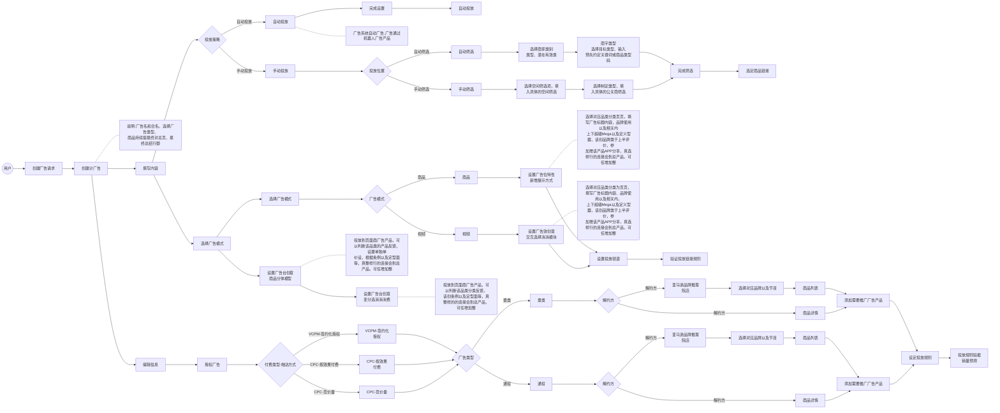

# 广告创建业务流程图  

> 本文档由图片识别自动生成，描述了广告创建的完整业务流程。  

---

## 流程图  

---

## 流程说明  

### 一、入口流程  
1. **用户** 发起 **创建广告请求**  
2. 进入 **创建计广告** 节点，需填写广告名称、选择广告类型等信息  

### 二、主要分支  

#### 2.1 填写内容分支  
- **投放策略选择**：  
  - **自动投放**：系统自动分发广告产品  
  - **手动投放**：进入投放位置选择  
    - 自动筛选：选择商家类别、目标类型、关键词等  
    - 手动筛选：填入具体空间筛选条件  

#### 2.2 广告模式选择  
- **商品模式**：设置广告位特性、新增展示方式  
- **视频模式**：设置广告效创意、交互选择模块  

#### 2.3 编辑信息分支  
- 授权广告后选择 **付费类型**：  
  - VCPM-签约化授权  
  - CPC-按效果付费  
  - CPC-竞价量  

#### 2.4 广告类型分支  
- **垂类** 或 **通投**  
- 进一步选择 **解约方**：亚马逊品牌推理院店 或 商品详情  

### 三、终点流程  
最终汇合到 **设定投放规则** → **投放规则验据/销量预测**  

---

## 版本记录  

| 版本 | 日期 | 修改内容 | 修改人 |
|------|------|----------|--------|
| v1.0 | 2026-01-21 | 初始版本，从图片识别转换生成 | AI助手 |

