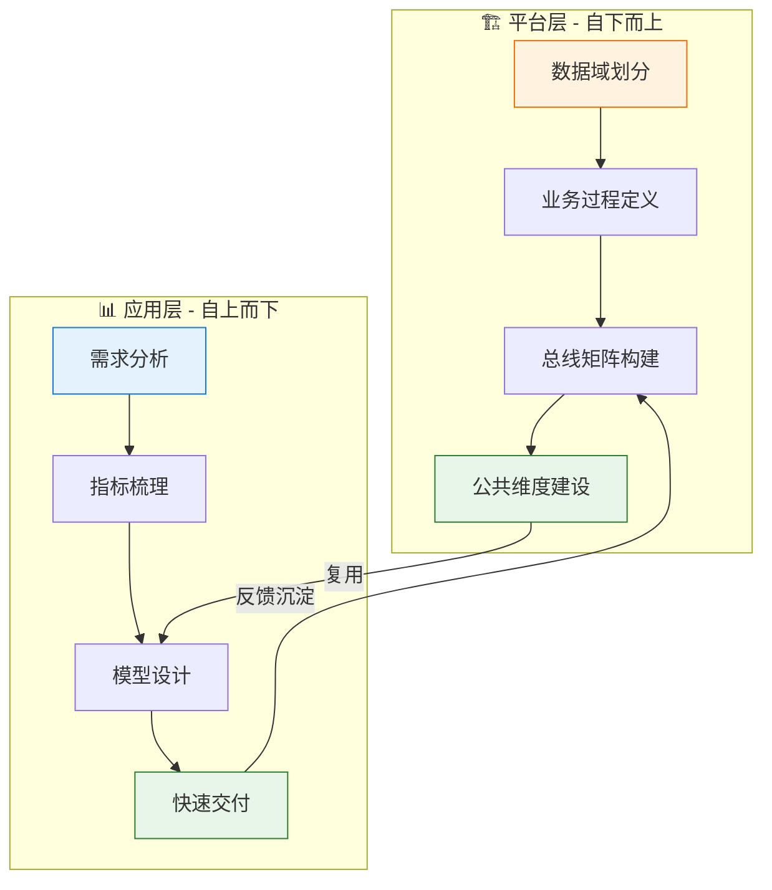

# 数据中心建设方法论  

> **文档版本**: v1.0  
> **创建日期**: 2026-01-23  
> **文档说明**: 数据中心数据建设的整体方法论与实施路径，涵盖需求驱动与数据驱动两种模式  

---

## 一、方法论概述  

数据中心建设遵循 **Kimball 维度建模方法论**，核心理念是构建**企业级数据仓库总线架构**。  

根据项目启动条件不同，建设路径分为两种模式：  

<table>
  <thead>
    <tr>
      <th>模式</th>
      <th>驱动因素</th>
      <th>适用场景</th>
      <th>核心特点</th>
    </tr>
  </thead>
  <tbody>
    <tr>
      <td><strong>自上而下</strong></td>
      <td>业务需求驱动</td>
      <td>有明确的分析需求或报表需求</td>
      <td>从需求出发，逆向推导数据模型</td>
    </tr>
    <tr>
      <td><strong>自下而上</strong></td>
      <td>数据资产驱动</td>
      <td>无明确需求，但需沉淀数据资产</td>
      <td>从业务流程出发，正向构建数据模型</td>
    </tr>
  </tbody>
</table>

> [!IMPORTANT]
> 两种模式并非互斥，实际项目中常常**混合使用**：先用自下而上的方式构建基础数据资产，再用自上而下的方式响应具体需求。  

---

## 二、自上而下：需求驱动模式  

### 2.1 适用场景  

- ✅ 业务方有明确的分析需求或报表需求  
- ✅ 有具体的数据产品目标（如仪表盘、报告）  
- ✅ 项目时间紧迫，需要快速交付价值  

### 2.2 核心流程  

### 2.3 详细步骤  

<table>
  <thead>
    <tr>
      <th>序号</th>
      <th>步骤</th>
      <th>输入</th>
      <th>核心活动</th>
      <th>输出</th>
    </tr>
  </thead>
  <tbody>
    <tr>
      <td>1</td>
      <td><strong>需求分析</strong></td>
      <td>业务需求文档</td>
      <td>理解业务目标，明确分析场景</td>
      <td>需求理解文档</td>
    </tr>
    <tr>
      <td>2</td>
      <td><strong>指标梳理</strong></td>
      <td>需求理解文档</td>
      <td>拆解需要的指标，定义计算逻辑</td>
      <td>指标定义表</td>
    </tr>
    <tr>
      <td>3</td>
      <td><strong>维度分析</strong></td>
      <td>指标定义表</td>
      <td>分析指标需要的分析维度</td>
      <td>维度清单</td>
    </tr>
    <tr>
      <td>4</td>
      <td><strong>粒度定义</strong></td>
      <td>维度清单</td>
      <td>确定事实表的最细粒度</td>
      <td>粒度定义文档</td>
    </tr>
    <tr>
      <td>5</td>
      <td><strong>事实表设计</strong></td>
      <td>粒度定义、指标定义</td>
      <td>设计事实表结构，确定度量字段</td>
      <td>事实表模型</td>
    </tr>
    <tr>
      <td>6</td>
      <td><strong>维度表设计</strong></td>
      <td>维度清单</td>
      <td>设计维度表结构，确定层次属性</td>
      <td>维度表模型</td>
    </tr>
    <tr>
      <td>7</td>
      <td><strong>ETL开发</strong></td>
      <td>模型设计文档</td>
      <td>开发数据加工逻辑</td>
      <td>数据管道</td>
    </tr>
    <tr>
      <td>8</td>
      <td><strong>需求交付</strong></td>
      <td>数据管道</td>
      <td>数据验证、报表开发、用户培训</td>
      <td>数据产品</td>
    </tr>
  </tbody>
</table>

### 2.4 优缺点分析  

| 优点                   | 缺点               |
| ---------------------- | ------------------ |
| 目标明确，快速交付价值 | 容易形成数据孤岛   |
| 紧密贴合业务需求       | 模型复用性可能不足 |
| 项目风险可控           | 全局视角可能缺失   |

---

## 三、自下而上：数据驱动模式  

### 3.1 适用场景  

- ✅ 无明确业务需求，但需提前布局数据资产  
- ✅ 需要构建企业级统一数据底座  
- ✅ 希望沉淀可复用的数据资产  

### 3.2 核心流程  

### 3.3 详细步骤  

<table>
  <thead>
    <tr>
      <th>序号</th>
      <th>步骤</th>
      <th>输入</th>
      <th>核心活动</th>
      <th>输出</th>
    </tr>
  </thead>
  <tbody>
    <tr>
      <td>1</td>
      <td><strong>业务领域划分</strong></td>
      <td>企业业务全景</td>
      <td>识别核心业务领域，划分数据域</td>
      <td>数据域定义表</td>
    </tr>
    <tr>
      <td>2</td>
      <td><strong>业务流程梳理</strong></td>
      <td>数据域定义表</td>
      <td>梳理各域的端到端业务流程</td>
      <td>业务流程图</td>
    </tr>
    <tr>
      <td>3</td>
      <td><strong>业务过程识别</strong></td>
      <td>业务流程图</td>
      <td>从流程中提取原子级业务过程</td>
      <td>业务过程清单</td>
    </tr>
    <tr>
      <td>4</td>
      <td><strong>粒度定义</strong></td>
      <td>业务过程清单</td>
      <td>为每个业务过程定义最细粒度</td>
      <td>粒度定义文档</td>
    </tr>
    <tr>
      <td>5</td>
      <td><strong>事实表设计</strong></td>
      <td>粒度定义</td>
      <td>设计事实表，确定类型和度量</td>
      <td>事实表模型</td>
    </tr>
    <tr>
      <td>6</td>
      <td><strong>维度识别</strong></td>
      <td>事实表模型</td>
      <td>识别事实表关联的分析维度</td>
      <td>维度清单</td>
    </tr>
    <tr>
      <td>7</td>
      <td><strong>总线矩阵构建</strong></td>
      <td>事实表、维度清单</td>
      <td>构建业务过程×维度的矩阵</td>
      <td>企业级总线矩阵</td>
    </tr>
    <tr>
      <td>8</td>
      <td><strong>ETL开发</strong></td>
      <td>模型设计文档</td>
      <td>按优先级逐步开发数据管道</td>
      <td>数据资产</td>
    </tr>
  </tbody>
</table>

### 3.4 优缺点分析  

| 优点               | 缺点                   |
| ------------------ | ---------------------- |
| 全局视角，架构完整 | 前期投入大，见效慢     |
| 数据资产可复用性强 | 需要较强的业务理解能力 |
| 便于后续扩展和集成 | 可能偏离实际业务需求   |

---

## 四、两种模式对比  

<table>
  <thead>
    <tr>
      <th>对比维度</th>
      <th>自上而下（需求驱动）</th>
      <th>自下而上（数据驱动）</th>
    </tr>
  </thead>
  <tbody>
    <tr>
      <td><strong>起点</strong></td>
      <td>业务需求/分析场景</td>
      <td>业务领域/业务流程</td>
    </tr>
    <tr>
      <td><strong>目标</strong></td>
      <td>满足特定需求</td>
      <td>构建数据资产</td>
    </tr>
    <tr>
      <td><strong>交付周期</strong></td>
      <td>短（周级）</td>
      <td>长（月级）</td>
    </tr>
    <tr>
      <td><strong>复用性</strong></td>
      <td>较低</td>
      <td>较高</td>
    </tr>
    <tr>
      <td><strong>风险</strong></td>
      <td>数据孤岛</td>
      <td>过度设计</td>
    </tr>
    <tr>
      <td><strong>适用团队</strong></td>
      <td>需求响应型团队</td>
      <td>平台建设型团队</td>
    </tr>
  </tbody>
</table>

---

## 五、混合模式：最佳实践  

实际项目中，推荐采用 **"双轨并行"** 的混合模式：  

### 5.1 执行策略  

<table>
  <thead>
    <tr>
      <th>层次</th>
      <th>模式</th>
      <th>目标</th>
      <th>节奏</th>
    </tr>
  </thead>
  <tbody>
    <tr>
      <td><strong>平台层</strong></td>
      <td>自下而上</td>
      <td>构建企业级数据资产底座</td>
      <td>持续迭代，按季度规划</td>
    </tr>
    <tr>
      <td><strong>应用层</strong></td>
      <td>自上而下</td>
      <td>快速响应业务需求</td>
      <td>敏捷交付，按周迭代</td>
    </tr>
  </tbody>
</table>

### 5.2 协同机制  

1. **平台层 → 应用层**：提供可复用的公共维度和事实表，加速需求响应  
2. **应用层 → 平台层**：将高频复用的模型沉淀到平台层，形成数据资产  

> [!TIP]
> 建议设立 **数据治理委员会**，定期评审应用层模型，将高价值模型纳入平台层资产。  

---

## 六、核心产出物清单  

无论采用哪种模式，以下产出物是数据中心建设的核心资产：  

<table>
  <thead>
    <tr>
      <th>序号</th>
      <th>产出物</th>
      <th>说明</th>
      <th>建设模式</th>
    </tr>
  </thead>
  <tbody>
    <tr>
      <td>1</td>
      <td><strong>数据域定义表</strong></td>
      <td>企业数据领域的划分和定义</td>
      <td>自下而上</td>
    </tr>
    <tr>
      <td>2</td>
      <td><strong>业务过程清单</strong></td>
      <td>各数据域的原子级业务过程</td>
      <td>自下而上</td>
    </tr>
    <tr>
      <td>3</td>
      <td><strong>粒度定义文档</strong></td>
      <td>每个事实表的最细粒度定义</td>
      <td>两种模式</td>
    </tr>
    <tr>
      <td>4</td>
      <td><strong>维度模型</strong></td>
      <td>公共维度表的结构设计</td>
      <td>两种模式</td>
    </tr>
    <tr>
      <td>5</td>
      <td><strong>事实表模型</strong></td>
      <td>事实表的结构设计</td>
      <td>两种模式</td>
    </tr>
    <tr>
      <td>6</td>
      <td><strong>企业级总线矩阵</strong></td>
      <td>业务过程×维度的交叉矩阵</td>
      <td>自下而上</td>
    </tr>
    <tr>
      <td>7</td>
      <td><strong>指标定义表</strong></td>
      <td>业务指标的计算逻辑和口径</td>
      <td>自上而下</td>
    </tr>
  </tbody>
</table>

---

## 更新记录  

| 日期       | 版本 | 更新内容                                     | 更新人   |
| ---------- | ---- | -------------------------------------------- | -------- |
| 2026-01-23 | v1.0 | 初始版本，定义自上而下和自下而上两种建设模式 | AI架构师 |
