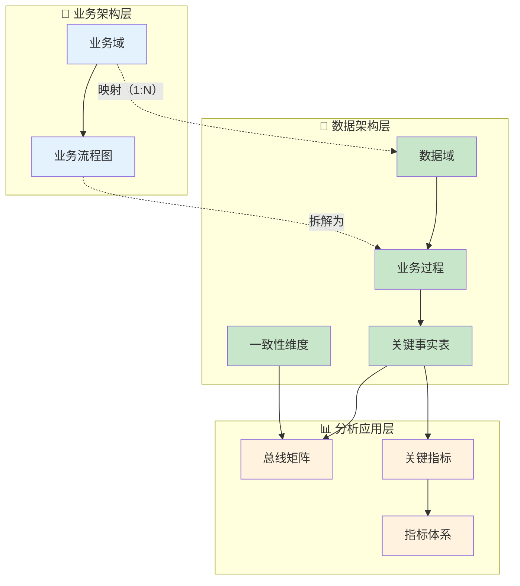
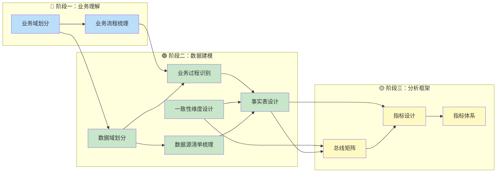
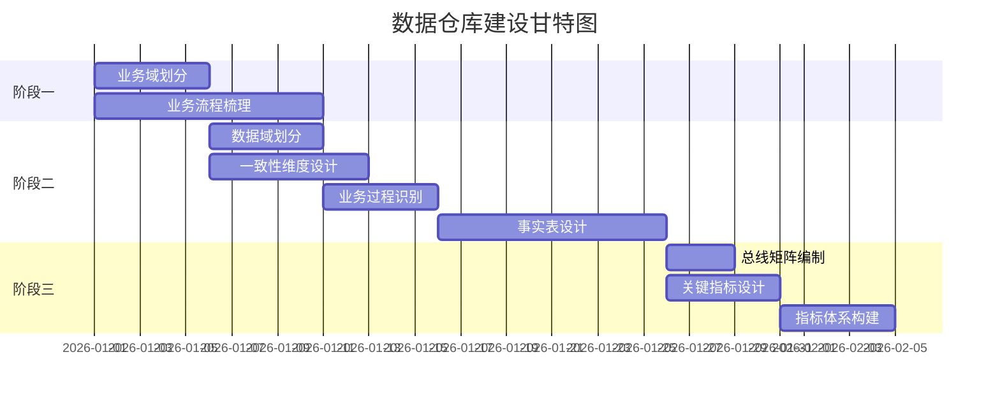

# 数据仓库核心概念与建设顺序  

> **文档版本**: v1.0  
> **创建日期**: 2026-01-26  
> **适用范围**: 数据仓库建设方法论  

---

## 一、核心概念定义  

<table>
    <thead>
        <tr>
            <th>序号</th>
            <th>概念名称</th>
            <th>英文</th>
            <th>定义</th>
            <th>举例</th>
        </tr>
    </thead>
    <tbody>
        <tr>
            <td>1</td>
            <td>业务域</td>
            <td>Business Domain</td>
            <td>企业经营活动的高层次分类，是业务架构的顶层划分，代表一类相对独立的业务职能领域。业务域是站在业务视角的划分，侧重于业务职能边界。</td>
            <td>销售业务域、采购业务域、生产业务域、物流业务域</td>
        </tr>
        <tr>
            <td>2</td>
            <td>业务流程图</td>
            <td>Business Process Flow</td>
            <td>描述业务域内各活动步骤的先后顺序和流转关系的可视化图表。用于展现从业务起点到终点的完整路径，包含决策点、并行活动和循环。</td>
            <td>订单处理流程图、生产排产流程图、采购收货流程图</td>
        </tr>
        <tr>
            <td>3</td>
            <td>数据域</td>
            <td>Data Domain</td>
            <td>数据仓库中按主题划分的数据集合区域，是面向分析的数据组织方式。数据域是站在数据视角的划分，侧重于数据资产管理边界。一个业务域可能对应多个数据域。</td>
            <td>交易域、库存域、履约域、促销域、广告域</td>
        </tr>
        <tr>
            <td>4</td>
            <td>业务过程</td>
            <td>Business Process</td>
            <td>企业运营中发生的、可度量的关键业务事件。具备原子性（不可再分）、可度量性（有数值指标）、时间点性（有明确发生时间）、可追溯性（有唯一标识）。每个业务过程对应一张事实表。</td>
            <td>创建订单、支付订单、头程入库、来料质检、创建广告活动</td>
        </tr>
        <tr>
            <td>5</td>
            <td>关键事实表</td>
            <td>Fact Table</td>
            <td>存储业务过程度量数据的核心表，记录"发生了什么"以及"数量是多少"。分为事务事实表（记录单次事件）、周期快照表（记录某时点状态）、累积快照表（跟踪完整流程）。</td>
            <td>fct_trd_order（订单事实表）、fct_inv_stock_daily（库存日快照）</td>
        </tr>
        <tr>
            <td>6</td>
            <td>一致性维度</td>
            <td>Conformed Dimension</td>
            <td>在多个数据域中共享使用、定义统一的维度表。确保不同数据域使用相同的描述属性，实现跨域分析的一致性。是维度建模的核心设计原则。</td>
            <td>时间维度、产品维度、店铺维度、仓库维度、供应商维度</td>
        </tr>
        <tr>
            <td>7</td>
            <td>总线矩阵</td>
            <td>Bus Matrix</td>
            <td>业务过程与维度的交叉映射表，用于展示每个业务过程可以从哪些维度进行分析。是确保跨域分析一致性的设计蓝图，也是验证维度设计完整性的工具。</td>
            <td>行=业务过程，列=维度，交叉点=是否关联（✓）</td>
        </tr>
        <tr>
            <td>8</td>
            <td>关键指标</td>
            <td>Key Metrics</td>
            <td>基于事实表度量值计算的、具有业务含义的数值。分为原子指标（直接聚合）和派生指标（公式计算）。指标有明确的聚合方式（SUM/AVG/COUNT等）和业务口径。</td>
            <td>订单金额（SUM）、客单价（AVG）、转化率（订单数/会话数）</td>
        </tr>
        <tr>
            <td>9</td>
            <td>指标体系</td>
            <td>Metrics System</td>
            <td>将所有指标按业务逻辑组织成的层次化结构。包含指标定义、计算公式、数据来源、更新频率、责任人等元数据。是数据分析和报表开发的标准规范。</td>
            <td>GMV指标体系、库存指标体系、广告ROI指标体系</td>
        </tr>
        <tr>
            <td>10</td>
            <td>维度建模</td>
            <td>Dimensional Modeling</td>
            <td>一种面向分析的数据建模方法，由Ralph Kimball提出。核心是构建星型模型（事实表+维度表），遵循"四步设计法"：选择业务过程→声明粒度→确定维度→确定事实。相比范式建模，更易于业务理解和查询优化。</td>
            <td>星型模型、雪花模型、缓慢变化维（SCD）、退化维度</td>
        </tr>
        <tr>
            <td>11</td>
            <td>数据源清单</td>
            <td>Data Source Inventory</td>
            <td>记录所有数据来源的元数据目录，包含源系统名称、数据库/表信息、字段说明、更新频率、数据负责人等。是ETL开发的前置依赖，用于评估数据可用性和质量。</td>
            <td>ERP系统表清单、电商平台API清单、第三方数据接口清单</td>
        </tr>
    </tbody>
</table>

---

## 二、概念关系图  



---

## 三、概念对比与澄清  

### 3.1 业务域 vs 数据域  

| 对比维度     | 业务域                                  | 数据域                     |
| ------------ | --------------------------------------- | -------------------------- |
| **视角**     | 业务职能视角                            | 数据资产视角               |
| **目的**     | 理解业务运作                            | 组织数据资产               |
| **粒度**     | 较粗，按职能划分                        | 较细，按主题划分           |
| **映射关系** | 一个业务域可对应多个数据域              | 多个数据域可服务一个业务域 |
| **举例**     | 供应链业务域 → 库存域 + 履约域 + 供采域 | 交易域 ← 销售业务域        |

### 3.2 业务流程图 vs 业务过程  

| 对比维度   | 业务流程图               | 业务过程             |
| ---------- | ------------------------ | -------------------- |
| **性质**   | 活动序列的可视化展示     | 可度量的原子事件     |
| **粒度**   | 整体流程（包含多个步骤） | 单个事件节点         |
| **关系**   | 一个流程包含多个业务过程 | 业务过程从流程中识别 |
| **输出物** | Mermaid/Visio流程图      | 事实表设计           |

### 3.3 事实表 vs 维度表  

| 对比维度     | 事实表                         | 维度表                                     |
| ------------ | ------------------------------ | ------------------------------------------ |
| **存储内容** | 业务度量值（数值）             | 描述属性（文本/分类）                      |
| **回答问题** | 发生了多少？（How Much）       | 谁/什么/哪里/何时？（Who/What/Where/When） |
| **行数**     | 大量（随业务增长）             | 较少（相对稳定）                           |
| **更新方式** | 只增不改（事务）或覆盖（快照） | 缓慢变化（SCD）                            |

---

## 四、建设顺序与依赖关系  

### 4.1 依赖关系图（核心）  



> [!NOTE]
> **维度建模** 贯穿阶段二的全过程，是一致性维度设计和事实表设计的方法论基础。

### 4.2 建设阶段详解  

<table>
    <thead>
        <tr>
            <th>阶段</th>
            <th>任务</th>
            <th>输入依赖</th>
            <th>输出产物</th>
            <th>可并行项</th>
        </tr>
    </thead>
    <tbody>
        <tr>
            <td rowspan="2">阶段一<br/>业务理解</td>
            <td>① 业务域划分</td>
            <td>无（起点）</td>
            <td>业务域清单</td>
            <td rowspan="2">①②可并行</td>
        </tr>
        <tr>
            <td>② 业务流程梳理</td>
            <td>业务域清单（可同步进行）</td>
            <td>业务流程图</td>
        </tr>
        <tr>
            <td rowspan="3">阶段二<br/>数据建模</td>
            <td>③ 数据域划分</td>
            <td>业务域清单</td>
            <td>数据域清单</td>
            <td rowspan="3">③⑤可并行</td>
        </tr>
        <tr>
            <td>④ 业务过程识别</td>
            <td>业务流程图 + 数据域清单</td>
            <td>业务过程清单</td>
        </tr>
        <tr>
            <td>⑤ 一致性维度设计</td>
            <td>数据域清单（可与③并行）</td>
            <td>一致性维度目录</td>
        </tr>
        <tr>
            <td>⑥ 数据源清单梳理</td>
            <td>数据域清单（可与④⑤并行）</td>
            <td>数据源清单</td>
        </tr>
        <tr>
            <td></td>
            <td>⑦ 事实表设计（维度建模）</td>
            <td>业务过程 + 一致性维度 + 数据源</td>
            <td>事实表模型</td>
            <td>-</td>
        </tr>
        <tr>
            <td rowspan="3">阶段三<br/>分析框架</td>
            <td>⑧ 总线矩阵编制</td>
            <td>事实表 + 一致性维度</td>
            <td>总线矩阵</td>
            <td rowspan="3">⑧⑨可并行</td>
        </tr>
        <tr>
            <td>⑨ 关键指标设计</td>
            <td>事实表（可与⑧并行）</td>
            <td>指标定义</td>
        </tr>
        <tr>
            <td>⑩ 指标体系构建</td>
            <td>关键指标 + 总线矩阵</td>
            <td>指标体系文档</td>
        </tr>
    </tbody>
</table>

---

### 4.3 关键依赖链（串行路径）  

```
业务域 → 业务流程图 → 业务过程 → 事实表 → 指标 → 指标体系
                          ↑
              一致性维度 ──┘
```

**最长路径（关键路径）**：业务域 → 流程图 → 业务过程 → 事实表 → 指标 → 指标体系  

> [!IMPORTANT]  
> **事实表设计** 是核心瓶颈节点，必须等待 **业务过程识别** 和 **一致性维度设计** 都完成后才能开始。  

---

### 4.4 可并行任务清单  

| 并行组    | 任务A        | 任务B          | 任务C          | 说明                               |
| --------- | ------------ | -------------- | -------------- | ---------------------------------- |
| **并行1** | 业务域划分   | 业务流程梳理   | -              | 可同步进行，流程图不需等域定义完成 |
| **并行2** | 业务过程识别 | 一致性维度设计 | 数据源清单梳理 | 都依赖数据域划分，可同步开展       |
| **并行3** | 总线矩阵编制 | 关键指标设计   | -              | 都依赖事实表，可同步开展           |

---

## 五、实操建设顺序（推荐）  

### 5.1 按阶段的标准顺序  



### 5.2 快速启动路径（最小可行版本MVP）  

如果时间紧迫，可按以下顺序快速完成核心交付：  

| 步骤 | 任务                       | 耗时 | 输出            |
| ---- | -------------------------- | ---- | --------------- |
| 1    | 业务流程梳理（核心域）     | 3天  | 2-3个核心流程图 |
| 2    | 识别业务过程 + 定义数据域  | 2天  | 业务过程清单    |
| 3    | 设计一致性维度（公共维度） | 2天  | 5-8个公共维度   |
| 4    | 设计事实表（核心表）       | 3天  | 核心事实表模型  |
| 5    | 编制总线矩阵               | 1天  | 总线矩阵初版    |
| 6    | 定义关键指标               | 2天  | 核心指标清单    |

**最短路径总耗时**: 约 **13天**  

---

## 六、常见问题澄清  

### Q1: 是否必须先完成所有业务域再开始数据域？  
**否**。可以按域逐个推进，先完成一个业务域的完整链路（业务域→流程→数据域→业务过程→事实表），再推进下一个。  

### Q2: 一致性维度必须在事实表之前完成吗？  
**是**。一致性维度决定了事实表的外键设计，必须先确定维度的主键和核心属性。  

### Q3: 总线矩阵和指标可以并行吗？  
**可以**。两者都依赖事实表完成，但可以同步进行。指标设计侧重度量值计算，总线矩阵侧重维度关联；最后在指标体系中整合。  

### Q4: 业务过程的粒度如何把握？  
**判断标准**：该事件是否有独立的业务单据或唯一标识？是否有明确发生时间？是否产生可度量数值？如果都满足，则可作为独立业务过程。  

---

## 七、概念关系总结  

```
┌─────────────────────────────────────────────────────────────────────┐
│                         数据仓库核心概念体系                          │
├─────────────────────────────────────────────────────────────────────┤
│  [业务层]                                                           │
│     业务域 ─────────┬───────────→ 业务流程图                        │
│        │           │               │                               │
│        │  (1:N)    │               │ (拆解)                        │
│        ↓           │               ↓                               │
│  [数据层]          │                                               │
│     数据域 ←───────┘         业务过程 ←───────┐                    │
│        │                        │            │                    │
│        │                        │            │                    │
│        │                        ↓            ↓                    │
│        └──────────────→ 关键事实表 ←── 一致性维度                   │
│                              │              │                     │
│                              │              │                     │
│  [分析层]                    ↓              ↓                     │
│                         总线矩阵 ←──────────┘                      │
│                              │                                    │
│                              ↓                                    │
│                         关键指标                                   │
│                              │                                    │
│                              ↓                                    │
│                         指标体系                                   │
└─────────────────────────────────────────────────────────────────────┘
```

---

## 更新记录  

| 版本 | 日期       | 更新内容                                             |
| ---- | ---------- | ---------------------------------------------------- |
| v1.0 | 2026-01-26 | 初始版本，定义9个核心概念及建设顺序                  |
| v1.1 | 2026-01-26 | 补充维度建模、数据源清单概念，更新建设阶段依赖关系图 |
