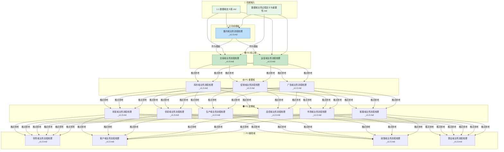

# ⛓️ 项目全链路执行手册：数据域业务流程梳理文档补全计划	

> **目标**: 以履约域业务流程梳理文档为模板，为所有16个数据域补充业务流程梳理文档	
> **创建日期**: 2026-01-19	
> **版本**: v1.1	

---

## 1. 产物目录结构 (File System)	

*项目所有产出将严格按照以下结构归档：*	

```text
output_LLM/
├── 数据域详情/                              # 各数据域详细文档存放目录
│   ├── 履约域业务流程梳理_v1.0.md          # 模板参考文件（已完成）
│   ├── 交易域业务流程梳理_v1.0.md          # 待生成
│   ├── 运营域业务流程梳理_v1.0.md          # 待生成
│   ├── 库存域业务流程梳理_v1.0.md          # 待生成
│   ├── 促销域业务流程梳理_v1.0.md          # 待生成
│   ├── 广告域业务流程梳理_v1.0.md          # 待生成
│   ├── 研发域业务流程梳理_v1.0.md          # 待生成
│   ├── 供采域业务流程梳理_v1.0.md          # 待生成
│   ├── 生产域业务流程梳理_v1.0.md          # 待生成
│   ├── 品控域业务流程梳理_v1.0.md          # 待生成
│   ├── 市场域业务流程梳理_v1.0.md          # 待生成
│   ├── 客服域业务流程梳理_v1.0.md          # 待生成
│   ├── 财务域业务流程梳理_v1.0.md          # 待生成
│   ├── 客户域业务流程梳理_v1.0.md          # 待生成
│   ├── 政策域业务流程梳理_v1.0.md          # 待生成
│   └── 算法域业务流程梳理_v1.0.md          # 待生成
├── 权威资料/
│   ├── 1.1 数据域定义表.md                 # 数据域定义元数据
│   └── 数据域业务过程定义与重要性.md       # 业务过程定义规范
└── 计划书/
    └── 数据域业务流程梳理文档补全计划_v1.1.md  # 本计划书
```

---

## 2. 产物依赖流 (Artifact Flow)	

> *箭头表示数据的流向：前一个文件的内容是生成后一个文件的必要条件。*	



---

## 3. 待处理数据域清单	

| 序号 | 数据域 | 编码 | 优先级 | 业务过程数 | 状态 |	
|------|--------|------|--------|------------|------|	
| 1 | 交易域 | trd | P0 | 6 | ⏳ 待处理 |	
| 2 | 运营域 | op | P0 | 5 | ⏳ 待处理 |	
| 3 | 库存域 | inv | P1 | 5 | ⏳ 待处理 |	
| 4 | 履约域 | fl | P1 | 4 | ✅ 已完成 |	
| 5 | 促销域 | prm | P1 | 3 | ⏳ 待处理 |	
| 6 | 广告域 | ads | P1 | 6 | ⏳ 待处理 |	
| 7 | 研发域 | rd | P2 | 2 | ⏳ 待处理 |	
| 8 | 供采域 | sup | P2 | 3 | ⏳ 待处理 |	
| 9 | 生产域 | mfg | P2 | 3 | ⏳ 待处理 |	
| 10 | 品控域 | qc | P2 | 4 | ⏳ 待处理 |	
| 11 | 市场域 | mkt | P2 | 4 | ⏳ 待处理 |	
| 12 | 客服域 | cs | P2 | 3 | ⏳ 待处理 |	
| 13 | 财务域 | fin | P3 | 7 | ⏳ 待处理 |	
| 14 | 客户域 | cst | P3 | 2 | ⏳ 待处理 |	
| 15 | 政策域 | pol | P3 | 2 | ⏳ 待处理 |	
| 16 | 算法域 | ma | P3 | 2 | ⏳ 待处理 |	

---

## 4. 文档模板结构	

每个域的业务流程梳理文档将包含以下章节：	

1. **域业务全景** - 该域的核心定位和业务范围	
2. **业务流程图** - 使用 Mermaid 绘制业务流程关系图	
3. **业务过程时序关系** - 按阶段划分业务过程，说明触发条件和产出结果	
4. **业务主线解读** - 文字解释业务逻辑	
5. **业务过程顺序汇总表** - 总结表格	
6. **理解难点说明** - 解释可能产生疑惑的地方	

---

## 5. 分步执行链 (Execution Chain)	

### 🟢 阶段一：P0 核心域	
*此阶段处理最高优先级的核心业务域。*	

- [ ] **Step 1.1: 交易域业务流程梳理**	
    - 📥 **Input (依赖)**:	
        - `权威资料/1.1 数据域定义表.md` (获取交易域定义和业务过程清单)	
        - `权威资料/数据域业务过程定义与重要性.md` (遵循业务过程定义规范)	
        - `数据域详情/履约域业务流程梳理_v1.0.md` (**模板参考**)	
    - 📤 **Output (产出)**: `数据域详情/交易域业务流程梳理_v1.0.md`	
    - 💡 **执行逻辑**: 严格按照履约域模板结构，结合交易域的6个业务过程，生成业务流程梳理文档。	
    - > **🤖 AI指令**: 请**详细阅读** `履约域业务流程梳理_v1.0.md` 作为模板，参考 `1.1 数据域定义表.md` 中交易域的业务过程定义，遵循 `数据域业务过程定义与重要性.md` 的规范，生成 `交易域业务流程梳理_v1.0.md`。文档需包含：域业务全景、Mermaid业务流程图、业务过程时序关系、业务主线解读、业务过程顺序汇总表、理解难点说明。	

- [ ] **Step 1.2: 运营域业务流程梳理**	
    - 📥 **Input (依赖)**:	
        - `权威资料/1.1 数据域定义表.md` (获取运营域定义和业务过程清单)	
        - `权威资料/数据域业务过程定义与重要性.md` (遵循业务过程定义规范)	
        - `数据域详情/履约域业务流程梳理_v1.0.md` (**模板参考**)	
        - `数据域详情/交易域业务流程梳理_v1.0.md` (格式一致性参考)	
    - 📤 **Output (产出)**: `数据域详情/运营域业务流程梳理_v1.0.md`	
    - 💡 **执行逻辑**: 运营域与交易域紧密关联，需体现二者业务联动关系。	
    - > **🤖 AI指令**: 请阅读 `履约域业务流程梳理_v1.0.md` 和 `交易域业务流程梳理_v1.0.md`，参考 `1.1 数据域定义表.md` 中运营域的5个业务过程，生成 `运营域业务流程梳理_v1.0.md`。	

### 🟡 阶段二：P1 重要域	
*此阶段处理重要性较高的业务支撑域。*	

- [x] **Step 2.0: 履约域业务流程梳理（已完成）**	
    - 📤 **Output (产出)**: `数据域详情/履约域业务流程梳理_v1.0.md` ✅	

- [ ] **Step 2.1: 库存域业务流程梳理**	
    - 📥 **Input (依赖)**:	
        - `权威资料/1.1 数据域定义表.md`	
        - `权威资料/数据域业务过程定义与重要性.md`	
        - `数据域详情/履约域业务流程梳理_v1.0.md` (**模板参考**)	
    - 📤 **Output (产出)**: `数据域详情/库存域业务流程梳理_v1.0.md`	
    - 💡 **执行逻辑**: 库存域与履约域在物流层面紧密关联。	
    - > **🤖 AI指令**: 参照模板生成库存域的5个业务过程的流程梳理文档。	

- [ ] **Step 2.2: 促销域业务流程梳理**	
    - 📥 **Input (依赖)**:	
        - `权威资料/1.1 数据域定义表.md`	
        - `权威资料/数据域业务过程定义与重要性.md`	
        - `数据域详情/履约域业务流程梳理_v1.0.md` (**模板参考**)	
    - 📤 **Output (产出)**: `数据域详情/促销域业务流程梳理_v1.0.md`	
    - 💡 **执行逻辑**: 促销域与交易域在营销层面紧密关联。	
    - > **🤖 AI指令**: 参照模板生成促销域的3个业务过程的流程梳理文档。	

- [ ] **Step 2.3: 广告域业务流程梳理**	
    - 📥 **Input (依赖)**:	
        - `权威资料/1.1 数据域定义表.md`	
        - `权威资料/数据域业务过程定义与重要性.md`	
        - `数据域详情/履约域业务流程梳理_v1.0.md` (**模板参考**)	
    - 📤 **Output (产出)**: `数据域详情/广告域业务流程梳理_v1.0.md`	
    - 💡 **执行逻辑**: 广告域涉及投放全链路。	
    - > **🤖 AI指令**: 参照模板生成广告域的6个业务过程的流程梳理文档。	

### 🟠 阶段三：P2 支撑域	
*此阶段处理企业运营支撑类业务域。*	

- [ ] **Step 3.1: 研发域业务流程梳理**	
    - 📥 **Input (依赖)**: 权威资料 + 模板文件	
    - 📤 **Output (产出)**: `数据域详情/研发域业务流程梳理_v1.0.md`	
    - > **🤖 AI指令**: 参照模板生成研发域的2个业务过程的流程梳理文档。	

- [ ] **Step 3.2: 供采域业务流程梳理**	
    - 📥 **Input (依赖)**: 权威资料 + 模板文件	
    - 📤 **Output (产出)**: `数据域详情/供采域业务流程梳理_v1.0.md`	
    - > **🤖 AI指令**: 参照模板生成供采域的3个业务过程的流程梳理文档。	

- [ ] **Step 3.3: 生产域业务流程梳理**	
    - 📥 **Input (依赖)**: 权威资料 + 模板文件	
    - 📤 **Output (产出)**: `数据域详情/生产域业务流程梳理_v1.0.md`	
    - > **🤖 AI指令**: 参照模板生成生产域的3个业务过程的流程梳理文档。	

- [ ] **Step 3.4: 品控域业务流程梳理**	
    - 📥 **Input (依赖)**: 权威资料 + 模板文件	
    - 📤 **Output (产出)**: `数据域详情/品控域业务流程梳理_v1.0.md`	
    - > **🤖 AI指令**: 参照模板生成品控域的4个业务过程的流程梳理文档。	

- [ ] **Step 3.5: 市场域业务流程梳理**	
    - 📥 **Input (依赖)**: 权威资料 + 模板文件	
    - 📤 **Output (产出)**: `数据域详情/市场域业务流程梳理_v1.0.md`	
    - > **🤖 AI指令**: 参照模板生成市场域的4个业务过程的流程梳理文档。	

- [ ] **Step 3.6: 客服域业务流程梳理**	
    - 📥 **Input (依赖)**: 权威资料 + 模板文件	
    - 📤 **Output (产出)**: `数据域详情/客服域业务流程梳理_v1.0.md`	
    - > **🤖 AI指令**: 参照模板生成客服域的3个业务过程的流程梳理文档。	

### 🔴 阶段四：P3 辅助域	
*此阶段处理辅助性业务域。*	

- [ ] **Step 4.1: 财务域业务流程梳理**	
    - 📥 **Input (依赖)**: 权威资料 + 模板文件	
    - 📤 **Output (产出)**: `数据域详情/财务域业务流程梳理_v1.0.md`	
    - > **🤖 AI指令**: 参照模板生成财务域的7个业务过程的流程梳理文档。	

- [ ] **Step 4.2: 客户域业务流程梳理**	
    - 📥 **Input (依赖)**: 权威资料 + 模板文件	
    - 📤 **Output (产出)**: `数据域详情/客户域业务流程梳理_v1.0.md`	
    - > **🤖 AI指令**: 参照模板生成客户域的2个业务过程的流程梳理文档。	

- [ ] **Step 4.3: 政策域业务流程梳理**	
    - 📥 **Input (依赖)**: 权威资料 + 模板文件	
    - 📤 **Output (产出)**: `数据域详情/政策域业务流程梳理_v1.0.md`	
    - > **🤖 AI指令**: 参照模板生成政策域的2个业务过程的流程梳理文档。	

- [ ] **Step 4.4: 算法域业务流程梳理**	
    - 📥 **Input (依赖)**: 权威资料 + 模板文件	
    - 📤 **Output (产出)**: `数据域详情/算法域业务流程梳理_v1.0.md`	
    - > **🤖 AI指令**: 参照模板生成算法域的2个业务过程的流程梳理文档。	

---

## 6. 输出文件路径规划	

| 序号 | 数据域 | 输出文件名 | 完整路径 |	
|------|--------|------------|----------|	
| 1 | 交易域 | 交易域业务流程梳理_v1.0.md | output_LLM/数据域详情/交易域业务流程梳理_v1.0.md |	
| 2 | 运营域 | 运营域业务流程梳理_v1.0.md | output_LLM/数据域详情/运营域业务流程梳理_v1.0.md |	
| 3 | 库存域 | 库存域业务流程梳理_v1.0.md | output_LLM/数据域详情/库存域业务流程梳理_v1.0.md |	
| 4 | 履约域 | 履约域业务流程梳理_v1.0.md | output_LLM/数据域详情/履约域业务流程梳理_v1.0.md |	
| 5 | 促销域 | 促销域业务流程梳理_v1.0.md | output_LLM/数据域详情/促销域业务流程梳理_v1.0.md |	
| 6 | 广告域 | 广告域业务流程梳理_v1.0.md | output_LLM/数据域详情/广告域业务流程梳理_v1.0.md |	
| 7 | 研发域 | 研发域业务流程梳理_v1.0.md | output_LLM/数据域详情/研发域业务流程梳理_v1.0.md |	
| 8 | 供采域 | 供采域业务流程梳理_v1.0.md | output_LLM/数据域详情/供采域业务流程梳理_v1.0.md |	
| 9 | 生产域 | 生产域业务流程梳理_v1.0.md | output_LLM/数据域详情/生产域业务流程梳理_v1.0.md |	
| 10 | 品控域 | 品控域业务流程梳理_v1.0.md | output_LLM/数据域详情/品控域业务流程梳理_v1.0.md |	
| 11 | 市场域 | 市场域业务流程梳理_v1.0.md | output_LLM/数据域详情/市场域业务流程梳理_v1.0.md |	
| 12 | 客服域 | 客服域业务流程梳理_v1.0.md | output_LLM/数据域详情/客服域业务流程梳理_v1.0.md |	
| 13 | 财务域 | 财务域业务流程梳理_v1.0.md | output_LLM/数据域详情/财务域业务流程梳理_v1.0.md |	
| 14 | 客户域 | 客户域业务流程梳理_v1.0.md | output_LLM/数据域详情/客户域业务流程梳理_v1.0.md |	
| 15 | 政策域 | 政策域业务流程梳理_v1.0.md | output_LLM/数据域详情/政策域业务流程梳理_v1.0.md |	
| 16 | 算法域 | 算法域业务流程梳理_v1.0.md | output_LLM/数据域详情/算法域业务流程梳理_v1.0.md |	

---

## 7. 验证方式	

1. **文档格式验证** - 确保每个文档遵循模板结构	
2. **内容完整性** - 确保覆盖所有业务过程	
3. **Mermaid语法** - 验证流程图可正常渲染	
4. **用户审阅** - 提交用户进行业务逻辑校验	

---

## 更新记录	

| 版本 | 日期 | 更新内容 |	
|------|------|----------|	
| v1.0 | 2026-01-19 | 初始计划 |	
| v1.1 | 2026-01-19 | 按流程架构师模板重构：增加产物目录结构、产物依赖流图、分步执行链（含 Input/Output 依赖和 AI 指令） |	
