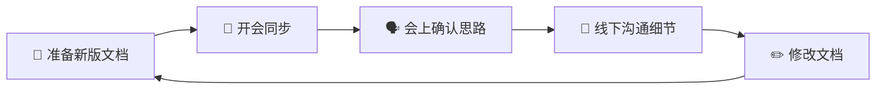

# 数据域梳理协同机制  

## 一、目的  

建立一套标准化的协同流程，确保数据域梳理工作能够高效、有序地进行迭代优化，保证所有参与人员对数据域定义达成共识。  

---

## 二、协同流程  

---

## 三、角色与职责  

| 角色             | 职责                           |
| ---------------- | ------------------------------ |
| **文档负责人**   | 负责文档的编写、修改、版本管理 |
| **业务方代表**   | 提供业务视角的反馈和确认       |
| **数据开发代表** | 提供技术视角的反馈和确认       |
| **会议主持人**   | 组织会议、推进讨论、记录结论   |

---

## 四、详细步骤  

### 4.1 准备阶段  

1. 文档负责人完成数据域梳理文档的编写或修改  
2. 按照版本管理规范命名文档（如：`xxx_v1.0.md`）  
3. 提前 1 天将文档发送给所有参会人员预览  

### 4.2 同步会议  

| 环节     | 时长建议  | 说明                       |
| -------- | --------- | -------------------------- |
| 文档宣讲 | 15-30分钟 | 负责人介绍本次变更内容     |
| 问题收集 | 10-15分钟 | 参会人员提出疑问和建议     |
| 思路确认 | 10-20分钟 | 针对重点问题讨论并达成共识 |
| 结论总结 | 5分钟     | 明确待修改事项和责任人     |

**会议产出：**  
- 问题清单（需线下沟通的细节问题）  
- 修改建议汇总  
- 下次会议时间（如有需要）  

### 4.3 线下沟通  

1. 针对会上确认的问题，文档负责人与相关人员**单独沟通**  
2. 沟通内容聚焦**具体细节**，避免重复讨论已达成共识的内容  
3. 沟通结果记录并反映到文档修改中  

### 4.4 文档更新  

1. 根据反馈修改文档  
2. 更新版本号（大改动升大版本，小调整升小版本）  
3. 在文档末尾补充**更新记录**  
4. 将旧版本移动至 `过期文件/` 目录  

---

## 五、文档状态标识  

| 状态         | 说明                             |
| ------------ | -------------------------------- |
| 🔴 **草稿**   | 初次编写，尚未经过评审           |
| 🟡 **评审中** | 正在进行协同评审，可能有多轮迭代 |
| 🟢 **已定稿** | 评审通过，作为正式版本发布       |
| ⚫ **已归档** | 旧版本，已移至过期文件目录       |

---

## 六、注意事项  

> [!IMPORTANT]  
> **会议聚焦思路，线下解决细节**  
> 会议时间宝贵，应专注于方向性、原则性问题的讨论，具体字段、命名等细节问题会后单独沟通。  

> [!TIP]  
> **提前预览，提高效率**  
> 建议参会人员会前认真阅读文档，会上直接抛出问题，减少现场阅读时间。  

> [!WARNING]  
> **版本管理必须严格执行**  
> 每次修改必须生成新版本，禁止直接覆盖原文件，确保修改历史可追溯。  

---

## 更新记录  

| 版本 | 日期       | 修改人 | 修改内容                   |
| ---- | ---------- | ------ | -------------------------- |
| v1.0 | 2026-01-23 | -      | 初始版本，建立协同机制框架 |
| v1.1 | 2026-01-23 | -      | 简化流程图，改为纯循环结构 |
