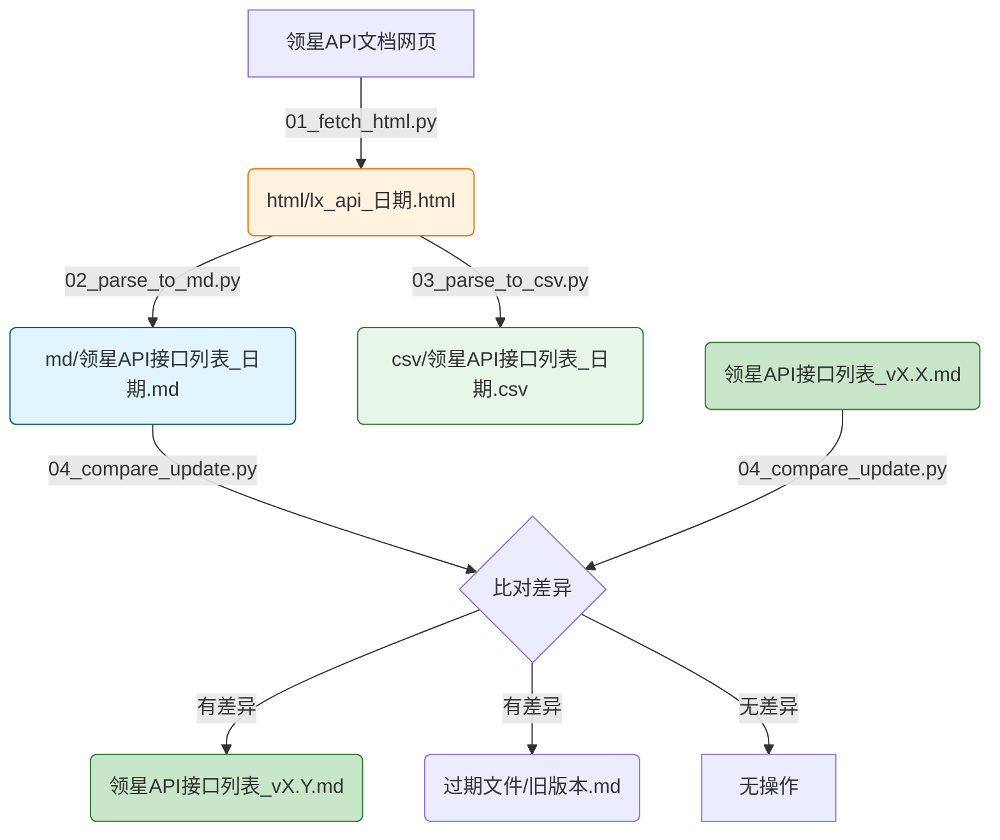

# ⛓️ 项目全链路执行手册：领星API文档管理系统重构  

> **版本**: v1.0  
> **创建日期**: 2026-01-28  
> **项目目标**: 重构现有脚本为独立模块化项目，实现 抓取网页 → 解析数据 → 输出MD/CSV → 比对更新版本 的完整流水线  

---

## 1. 产物目录结构 (File System)  

*项目所有产出将严格按照以下结构归档：*  

```text
output_LLM/领星API文档管理/
├── 领星API接口列表_v1.0.md      # 📌 正式文档（最新版，在根目录）
├── csv/                          # CSV输出目录
│   └── 领星API接口列表_20260128.csv
├── md/                           # MD临时输出目录（每日生成）
│   └── 领星API接口列表_20260128.md
├── html/                         # HTML源码缓存目录
│   └── lx_api_20260128.html
├── scripts/                      # 脚本目录
│   ├── 01_fetch_html.py          # 步骤1：抓取网页源码
│   ├── 02_parse_to_md.py         # 步骤2：解析为MD
│   ├── 03_parse_to_csv.py        # 步骤3：解析为CSV
│   ├── 04_compare_update.py      # 步骤4：比对更新版本
│   └── main.py                   # 主控脚本（串联所有步骤）
└── 过期文件/                      # 归档的旧版本
    └── 领星API接口列表_v1.0.md
```

---

## 2. 产物依赖流 (Artifact Flow)  

> *箭头表示数据的流向：前一个文件的内容是生成后一个文件的必要条件。*  



---

## 3. 分步执行链 (Execution Chain)  

### 🟢 阶段一：基础设施搭建  

*此阶段创建项目目录结构和通用工具。*  

- [ ] **Step 1.1: 创建项目目录结构**  
    - 📥 **Input (依赖)**: 无（首步骤）  
    - 📤 **Output (产出)**:   
        - `output_LLM/领星API文档管理/` 根目录  
        - `output_LLM/领星API文档管理/csv/`  
        - `output_LLM/领星API文档管理/md/`  
        - `output_LLM/领星API文档管理/html/`  
        - `output_LLM/领星API文档管理/scripts/`  
        - `output_LLM/领星API文档管理/过期文件/`  
    - 💡 **执行逻辑**: 建立标准化的文件目录结构，为后续脚本提供规范的输出位置。  
    - > **🤖 AI指令**: 创建上述完整的目录结构。  

---

### 🟡 阶段二：核心脚本开发  

*此阶段开发各个独立模块脚本。*  

- [ ] **Step 2.1: 抓取网页脚本 (01_fetch_html.py)**  
    - 📥 **Input (依赖)**:   
        - 网络访问能力  
        - 目标URL: `https://apidoc.lingxing.com/`  
    - 📤 **Output (产出)**: `scripts/01_fetch_html.py`  
    - 💡 **执行逻辑**: 使用Playwright无头浏览器访问领星API文档网站，等待页面加载完成后提取左侧导航栏的HTML源码。  
    - **脚本参数**:  
        - `--output-dir`: HTML输出目录（默认: `../html/`）  
        - `--output-file`: 输出文件名（可选，默认自动添加日期后缀）  
    - **输出文件**: `html/lx_api_YYYYMMDD.html`  
    - > **🤖 AI指令**: 参考现有的 `auto_fetch_lx_api.py`，重构为独立脚本，支持命令行参数。  

---

- [ ] **Step 2.2: 解析为Markdown脚本 (02_parse_to_md.py)**  
    - 📥 **Input (依赖)**:   
        - `scripts/01_fetch_html.py` 的设计规范  
        - `html/lx_api_日期.html` 作为输入文件  
    - 📤 **Output (产出)**: `scripts/02_parse_to_md.py`  
    - 💡 **执行逻辑**: 读取HTML文件，解析API接口信息，生成带有分类合并单元格的Markdown表格。  
    - **脚本参数**:  
        - `--input-file`: 输入HTML文件路径（必须）  
        - `--output-dir`: MD输出目录（默认: `../md/`）  
        - `--output-file`: 输出文件名（可选）  
    - **输出文件**: `md/领星API接口列表_YYYYMMDD.md`  
    - > **🤖 AI指令**: 参考现有的 `parse_lx_api_html.py` 中 Markdown 生成部分，重构为独立脚本。  

---

- [ ] **Step 2.3: 解析为CSV脚本 (03_parse_to_csv.py)**  
    - 📥 **Input (依赖)**:   
        - `scripts/02_parse_to_md.py` 的解析逻辑（共享）  
        - `html/lx_api_日期.html` 作为输入文件  
    - 📤 **Output (产出)**: `scripts/03_parse_to_csv.py`  
    - 💡 **执行逻辑**: 读取HTML文件，解析API接口信息，生成结构化CSV文件。  
    - **脚本参数**:  
        - `--input-file`: 输入HTML文件路径（必须）  
        - `--output-dir`: CSV输出目录（默认: `../csv/`）  
        - `--output-file`: 输出文件名（可选）  
    - **输出文件**: `csv/领星API接口列表_YYYYMMDD.csv`  
    - > **🤖 AI指令**: 参考现有的 `parse_lx_api_html.py` 中 CSV 生成部分，重构为独立脚本。  

---

- [ ] **Step 2.4: 比对更新脚本 (04_compare_update.py)**  
    - 📥 **Input (依赖)**:   
        - `scripts/02_parse_to_md.py` 生成的MD文件  
        - 项目根目录的正式文档 `领星API接口列表_vX.X.md`  
    - 📤 **Output (产出)**: `scripts/04_compare_update.py`  
    - 💡 **执行逻辑**: 比对每日MD和正式文档的差异，识别新增/删除/修改的接口，自动更新版本号并添加更新记录。  
    - **脚本参数**:  
        - `--daily-file`: 每日生成的MD文件路径（必须）  
        - `--official-dir`: 正式文档所在目录（默认: `../`，即项目根目录）  
        - `--archive-dir`: 过期文件归档目录（默认: `../过期文件/`）  
    - **输出文件**:   
        - `领星API接口列表_vX.Y.md`（新版本）  
        - `过期文件/领星API接口列表_vX.X.md`（旧版本归档）  
    - > **🤖 AI指令**: 参考现有的 `compare_and_update_api_docs.py`，重构为支持参数化调用。  

---

### 🔴 阶段三：主控脚本与集成测试  

- [ ] **Step 3.1: 主控脚本 (main.py)**  
    - 📥 **Input (依赖)**:   
        - `scripts/01_fetch_html.py`  
        - `scripts/02_parse_to_md.py`  
        - `scripts/03_parse_to_csv.py`  
        - `scripts/04_compare_update.py`  
    - 📤 **Output (产出)**: `scripts/main.py`  
    - 💡 **执行逻辑**: 串联所有步骤，支持一键执行完整流程或选择性执行部分步骤。  
    - **脚本功能**:  
        1. 自动检测今天日期，生成相应的文件名  
        2. 依次调用各步骤脚本，传递文件路径参数  
        3. 支持 `--skip-fetch` 跳过抓取步骤（使用现有HTML）  
        4. 支持 `--only-fetch` 仅执行抓取步骤  
        5. 打印执行摘要  
    - > **🤖 AI指令**: 创建主控脚本，通过 subprocess 或模块导入方式调用各步骤。  

---

- [ ] **Step 3.2: 集成测试与验证**  
    - 📥 **Input (依赖)**:  
        - 所有脚本文件  
        - 现有的测试数据（HTML源码）  
    - 📤 **Output (产出)**:  
        - 完整的执行日志  
        - 验证通过的正式文档  
    - 💡 **执行逻辑**: 运行 `main.py`，验证整个流程是否正常工作。  
    - > **🤖 AI指令**: 执行 `python main.py`，检查输出文件是否正确生成。  

---

- [ ] **Step 3.3: 迁移现有数据**  
    - 📥 **Input (依赖)**:  
        - 现有的 `output_LLM/领星API接口列表_v1.1.md`  
        - 现有的 `个人文件/lx_api.html`  
    - 📤 **Output (产出)**:  
        - 项目根目录的正式文档  
        - html目录的源码文件  
    - 💡 **执行逻辑**: 将现有文件迁移到新的项目结构中。  
    - > **🤖 AI指令**: 复制现有文件到新位置，确保项目可以正常运行。  

---

## 4. 脚本接口规范  

### 通用规范  

所有脚本必须遵循以下规范：  

| 规范项         | 说明                                           |
| -------------- | ---------------------------------------------- |
| **命令行参数** | 使用 `argparse` 解析参数                       |
| **返回值**     | 成功返回 0，失败返回非 0                       |
| **日志输出**   | 使用 `print()` 输出关键信息，便于 main.py 捕获 |
| **编码**       | UTF-8，文件头部声明 `# -*- coding: utf-8 -*-`  |
| **路径处理**   | 使用 `pathlib.Path` 处理路径                   |

### 脚本调用示例  

```bash
# 步骤1：抓取HTML
python scripts/01_fetch_html.py --output-dir html/

# 步骤2：解析为MD
python scripts/02_parse_to_md.py --input-file html/lx_api_20260128.html --output-dir md/

# 步骤3：解析为CSV
python scripts/03_parse_to_csv.py --input-file html/lx_api_20260128.html --output-dir csv/

# 步骤4：比对更新
python scripts/04_compare_update.py --daily-file md/领星API接口列表_20260128.md --official-dir ./

# 一键执行
python scripts/main.py
```

---

## 5. 版本记录  

| 版本 | 日期       | 更新内容                                 |
| ---- | ---------- | ---------------------------------------- |
| v1.0 | 2026-01-28 | 初始版本，完成项目结构设计和执行流程规划 |

---

## 6. 质量检查清单  

计划书审核要点：  

- [x] **依赖完整性**: 每个非首步骤的Input都来自前序Output  
- [x] **产物具体化**: 所有Output都是具体文件名/路径  
- [x] **指令可执行**: 每个🤖指令都包含具体文件引用  
- [x] **流程连贯性**: Mermaid图展示了完整的产物流转  
- [x] **目录合理性**: 文件命名有序，目录结构清晰  
- [x] **参数化设计**: 脚本通过参数传递文件路径，实现解耦  
