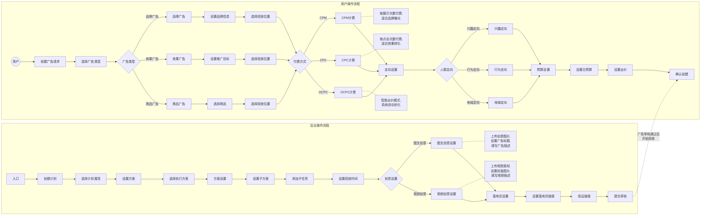

# 后台操作流程图  

> 本文档由图片识别自动生成，描述了广告创建的后台操作流程。  

---

## 流程图  

---

## 流程说明  

### 一、后台操作流程  

#### 1.1 计划创建阶段  
1. **入口** → 进入广告创建后台  
2. **创建计划** → 新建广告计划  
3. **选择计划属性** → 设置计划基础属性  
4. **设置方案** → 配置投放方案  

#### 1.2 创意设置阶段  
1. **创意设置** 分为两种类型：  
   - **图文创意**：上传图片素材，设置标题和描述  
   - **视频创意**：上传视频素材，设置封面和描述  

#### 1.3 落地页配置  
1. **落地页设置** → 配置广告跳转页面  
2. **验证链接** → 检验落地页有效性  
3. **提交审核** → 提交等待审核  

---

### 二、用户操作流程  

#### 2.1 广告类型选择  
- **品牌广告**：设置品牌信息，用于品牌曝光  
- **效果广告**：设置推广目标，用于效果转化  
- **商品广告**：选择商品，用于商品推广  

#### 2.2 付费方式选择  
| 付费方式 | 说明           | 适用场景     |
| -------- | -------------- | ------------ |
| CPM      | 按展示次数付费 | 品牌曝光     |
| CPC      | 按点击次数付费 | 效果转化     |
| OCPC     | 智能出价模式   | 系统自动优化 |

#### 2.3 定向设置  
- **兴趣定向**：根据用户兴趣标签定向  
- **行为定向**：根据用户行为数据定向  
- **地域定向**：根据用户地理位置定向  

#### 2.4 预算与出价  
1. **设置日预算** → 控制每日投放花费上限  
2. **设置出价** → 配置竞价策略  
3. **确认创建** → 完成广告创建  

---

## 流程关系  

后台操作流程与用户操作流程相互配合：  
- 后台操作流程侧重于 **技术配置和审核**  
- 用户操作流程侧重于 **业务需求和投放策略**  
- 两个流程通过 **广告审核** 环节进行衔接  

---

## 版本记录  

| 版本 | 日期       | 修改内容                     | 修改人 |
| ---- | ---------- | ---------------------------- | ------ |
| v1.0 | 2026-01-21 | 初始版本，从图片识别转换生成 | AI助手 |
